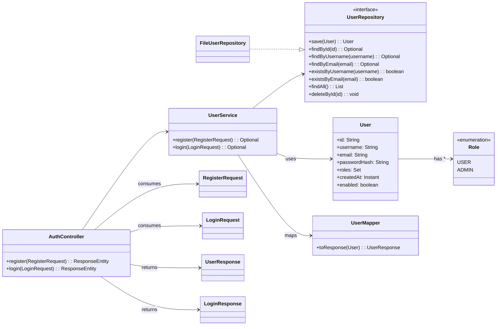
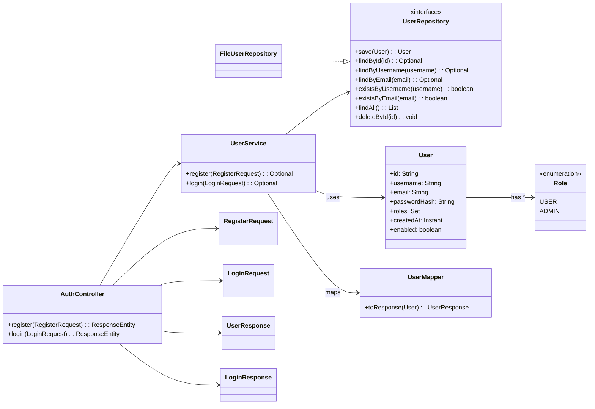


# 🧪 Laboratory 4 — Spring Boot Authentication API (Register & Login)

## 🎯 Objective

In this lab, you will build a **REST API** using **Spring Boot** that supports:

-   User **registration**
    
-   User **login**
    
-   API testing through **Swagger UI**
    

We will store users in a **file-based repository** for now.  
A real database (JPA + H2/PostgreSQL) will be added in the next lab.

## 📘 Prerequisites

-   JDK 21 or higher
    
-   IntelliJ IDEA (Community Edition is sufficient)
    
-   Maven
    
-   Basic understanding of HTTP and JSON
    
-   Postman or `curl` (optional — Swagger UI is enough for testing)
    

## 🗂️ Table of Contents

1.  Create Project
    
2.  Add Swagger UI & Security Redirect
    
3.  Project & Package Layout
    
4.  Domain Model
    
5.  Repository Contract
    
6.  File-backed Repository
    
7.  Configuration
    
8.  DTOs
    
9.  Mapper
    
10.  Service
    
11.  Controller
    
12.  Run & Test
    
13.  Lab Tasks
    
14.  Optional Challenges
    
15.  Troubleshooting & Tips
    
16.  Homework
    

## 📌 System Architecture (UML Overview)



## 1) Create Project — Spring Boot Generator (IntelliJ IDEA)

In this step, we set up a new Maven-based Spring Boot application.

### ✅ Step-by-Step Instructions

1️⃣ Open IntelliJ IDEA  
➡️ `File → New → Project`

2️⃣ Select:

-   **New Project** → **Spring Boot**
    
-   **Project Type:** Maven
    
-   **Java:** 21 (or higher)
    
-   **Spring Boot Version:** 3.5.x
    

3️⃣ Fill in project details:

| Field | Value |
|-------|-------|
| **Group** | `unitbv.devops` |
| **Artifact** | `authentication-api` |
| **Package Name** | `unitbv.devops.authenticationapi` |

4️⃣ On the “Dependencies” selection screen → check:

✅ **Spring Web**  
✅ **Spring Security**  
✅ **Validation** (Jakarta Validation)  
✅ **Lombok**  
✅ **Spring Boot DevTools** (optional but useful in labs)

Then click **Create** ✅

### 📌 What each dependency is for
| Dependency | Reason |
|------------|--------|
| **Spring Web** | REST API functionality + JSON support |
| **Spring Security** | Required for password hashing and future auth (JWT) |
| **Validation** | Enables automatic request validation (`@NotBlank`, `@Email`, `@Size`) |
| **Lombok** | Removes boilerplate (getters/setters/builders) |
| **DevTools** | Enables automatic restart during development |

### 1.2 Add Swagger UI dependency (manually)

Open `pom.xml` and add this inside `<dependencies>`:

```xml
<!-- Swagger UI for API testing -->
<dependency>
  <groupId>org.springdoc</groupId>
  <artifactId>springdoc-openapi-starter-webmvc-ui</artifactId>
  <version>2.6.0</version>
</dependency>

```

After editing `pom.xml`  
➡️ IntelliJ will ask you to **Load Maven Changes**  
Click ✅ _Load_

### 1.3 Run the application

You can now start the server:

-   Right-click the main class:  
    `AuthenticationApiApplication → Run`
    
-   OR terminal:
    

```bash
mvn spring-boot:run
```

✅ Server runs on **[http://localhost:8080/](http://localhost:8080/)**

## 2) Add Swagger UI & Security Redirect

In this chapter, we will:

-   Enable Swagger UI for testing our API
    
-   Disable Spring Security’s default login popup
    
-   Automatically redirect `/` → Swagger UI
    

### 2.1 Disable default login form + allow all requests

Create a new class:  
📌 `src/main/java/unitbv/devops/authenticationapi/config/SecurityConfig.java`

```java
package unitbv.devops.authenticationapi.config;

import org.springframework.context.annotation.Bean;
import org.springframework.context.annotation.Configuration;
import org.springframework.security.config.annotation.web.builders.HttpSecurity;
import org.springframework.security.web.SecurityFilterChain;

@Configuration
public class SecurityConfig {

    @Bean
    SecurityFilterChain securityFilterChain(HttpSecurity http) throws Exception {
        http
            .csrf(csrf -> csrf.disable())
            .authorizeHttpRequests(auth -> auth
                .anyRequest().permitAll()
            )
            .formLogin(form -> form.disable())
            .httpBasic(basic -> basic.disable());

        return http.build();
    }
}

```

✅ This removes any login prompt and allows us to build our own custom authentication later.

### 2.2 Redirect `/` → Swagger UI

Create this controller:  
📌 `src/main/java/unitbv/devops/authenticationapi/web/HomeController.java`

```java
package unitbv.devops.authenticationapi.web;

import org.springframework.stereotype.Controller;
import org.springframework.web.bind.annotation.GetMapping;

@Controller
public class HomeController {

    @GetMapping("/")
    public String home() {
        return "redirect:/swagger-ui/index.html";
    }
}

```

✅ Visiting `http://localhost:8080/` will now open Swagger UI automatically.

### 2.3 Check Swagger UI access

Start the application and open:

🔗 `http://localhost:8080/swagger-ui/index.html`

You should see a page like this (empty for now — endpoints will appear later):

> “Welcome to Swagger UI”

## 3) Project & Package Layout

Before implementing our Authentication API, we will organize the project into a clean package structure.

This will help ensure:

-   Clear separation of responsibilities
    
-   Easy refactoring when switching from file storage to a real database
    
-   Good readability for future labs
    

### 3.1 Create the following package structure

📌 In:  
`src/main/java/unitbv/devops/authenticationapi/`

```
authenticationapi  
├─ config/ # Global configuration: security, swagger, encoder  
├─ controller/ # REST controllers (entry points to the API)  
├─ dto/ # Request & response models for controller endpoints  
├─ service/ # Business logic for authentication  
└─ user/ # Domain model + repository abstraction & implementation

```
✅ This structure aligns with Spring Boot’s recommended layered architecture

### 3.2 What belongs in each package?

| Package | Purpose | Examples |
|---------|---------|----------|
| `config` | Application-wide configurations | `SecurityConfig`, `PasswordConfig`, `OpenAPIConfig` |
| `controller` | Handles HTTP requests only | `AuthController`, `HomeController` |
| `dto` | Request / Response models | `RegisterRequest`, `LoginResponse`, `UserResponse`, `LoginRequest` |
| `service` | Business logic and orchestration | `UserService` |
| `user` | Domain model + persistence logic | `User`, `Role`, `UserRepository`, `FileUserRepository` |

### 3.3 Architecture Overview (UML)



## 4) Domain Model (User & Role)

In this chapter, we define the **core domain model** used throughout the application:

-   `Role` — user type/permissions
    
-   `User` — main entity containing credentials and metadata
    

These classes live in the package:

📂 `src/main/java/unitbv/devops/authenticationapi/user/`

### 4.1 Create the `Role` Enumeration

Role identifies the permission level of a user.  
For now, we support a single standard role: `USER`.

📌 `Role.java`

```java
package unitbv.devops.authenticationapi.user;

public enum Role {
    USER,
    ADMIN
}

```

✅ Easily extendable later (e.g., ADMIN-only endpoints)

### 4.2 Create the `User` Domain Class

This class models a user and stores:  
✅ Username  
✅ Email  
✅ Secure hashed password (🚫 never plain-text)  
✅ Roles  
✅ Account status + creation timestamp  
✅ Unique ID (we’ll auto-generate it later)

📌 `User.java`

```java
package unitbv.devops.authenticationapi.user;

import lombok.*;
import java.time.Instant;
import java.util.Set;

@Getter
@Setter
@NoArgsConstructor
@AllArgsConstructor
@Builder
public class User {
    private String id;
    private String username;
    private String email;
    private String passwordHash;
    private Set<Role> roles;
    private Instant createdAt;
    private boolean enabled;
}
```

### 4.3 Design Notes & Best Practices

-   **Never expose credentials**: the `passwordHash` must never be returned by controllers. We’ll map domain objects to safe DTOs.
    
-   **Why no `@Entity` yet?** In this lab we use a file-backed repository. Adding JPA next lab will only require annotating the domain (or creating a JPA-mapped copy) and adding a new repository implementation that respects the same `UserRepository` interface.
    
-   **IDs**: Keep `String` for flexibility (UUIDs today, database-generated IDs tomorrow). We’ll assign it in the repository.
    
-   **Extensible roles**: Start with `USER`; add `ADMIN` later and secure admin-only routes.
    

### 4.4 Quick Sanity Check (what to commit)

-   `user/Role.java` created
    
-   `user/User.java` created
    
-   Project still builds and runs
    
## 5) Repository Contract – UserRepository Interface

In this chapter, we define the **abstraction for user data access**. This will allow our authentication system to remain independent of _where_ users are stored.

✅ Today: we will use a **file-backed repository**  
✅ Next lab: we can switch to **JPA + H2/PostgreSQL**  
➡️ No changes needed to service or controllers, because they depend only on the interface.

### 5.1 Purpose

The repository contract defines **what operations** our system requires to manage users.

| Operation | Description |
|----------|-------------|
| `save(User user)` | Create or update a user |
| `findById(String id)` | Retrieve a user by ID |
| `findByUsername(String username)` | Retrieve a user by unique username |
| `findByEmail(String email)` | Retrieve a user by unique email |
| `existsByUsername(String username)` | Check for username duplicates |
| `existsByEmail(String email)` | Check for email duplicates |
| `findAll()` | Retrieve all users |
| `deleteById(String id)` | Remove a user |


### 5.2 Create the Interface

📌 Create file:  
`src/main/java/unitbv/devops/authenticationapi/user/UserRepository.java`

```java
package unitbv.devops.authenticationapi.user;

import java.util.List;
import java.util.Optional;

public interface UserRepository {
    User save(User user);
    Optional<User> findById(String id);
    Optional<User> findByUsername(String username);
    Optional<User> findByEmail(String email);
    boolean existsByUsername(String username);
    boolean existsByEmail(String email);
    List<User> findAll();
    void deleteById(String id);
}
```

✅ The interface defines behavior only — no database logic.  
✅ Allows multiple implementations in the future.

### 5.3 Why this interface is important

| Benefit | Explanation |
|--------|-------------|
| **Loose coupling** | Service layer does not depend on storage implementation |
| **Easy migration** | Switching to JPA only requires a new `UserRepository` implementation |
| **Testability** | Mocking the interface allows unit testing without any storage |

## 6) File-backed Repository – Implementing the Interface

Now that we have the `UserRepository` interface defined, we will provide a first concrete implementation.

In this lab, we are not using a database yet. Instead, users will be stored in a **JSON file on disk**, and also cached in memory for fast access.

This allows the application to remain lightweight while still persisting user accounts between restarts.

### What this class is responsible for

-   Keep a map of users in memory
    
-   Load all users from a JSON file at startup
    
-   Save users to the file whenever modifications happen
    
-   Generate random unique IDs for new users
    

This class respects the `UserRepository` interface, meaning we can replace it easily with a database implementation later.

### Create storage configuration class

Create a config class that holds the file path used to store users.

File: `src/main/java/unitbv/devops/authenticationapi/user/UserStorageProperties.java`

```java
package unitbv.devops.authenticationapi.user;

import org.springframework.boot.context.properties.ConfigurationProperties;
import org.springframework.context.annotation.Configuration;

@Configuration
@ConfigurationProperties(prefix = "user.storage")
public class UserStorageProperties {

    private String filePath = "data/users.json";

    public String getFilePath() {
        return filePath;
    }

    public void setFilePath(String filePath) {
        this.filePath = filePath;
    }
}

```

### Create the repository implementation

File: `src/main/java/unitbv/devops/authenticationapi/user/FileUserRepository.java`

```java
package unitbv.devops.authenticationapi.user;

import com.fasterxml.jackson.core.type.TypeReference;
import com.fasterxml.jackson.databind.ObjectMapper;
import org.springframework.stereotype.Repository;

import java.io.IOException;
import java.nio.file.*;
import java.util.*;
import java.util.concurrent.locks.ReentrantReadWriteLock;

@Repository
public class FileUserRepository implements UserRepository {

    private final Path storagePath;
    private final ObjectMapper mapper;
    private final ReentrantReadWriteLock lock = new ReentrantReadWriteLock();
    private final Map<String, User> users = new HashMap<>();

    public FileUserRepository(ObjectMapper mapper, UserStorageProperties props) {
        this.mapper = mapper;
        this.storagePath = Paths.get(props.getFilePath());
        initFile();
        loadUsers();
    }

    private void initFile() {
        try {
            if (storagePath.getParent() != null) {
                Files.createDirectories(storagePath.getParent());
            }
            if (!Files.exists(storagePath)) {
                Files.writeString(storagePath, "[]");
            }
        } catch (IOException e) {
            throw new RuntimeException("Failed to initialize user storage", e);
        }
    }

    private void loadUsers() {
        lock.writeLock().lock();
        try {
            List<User> list = mapper.readValue(Files.readString(storagePath), new TypeReference<List<User>>(){});
            users.clear();
            for (User u : list) {
                users.put(u.getId(), u);
            }
        } catch (IOException e) {
            throw new RuntimeException("Failed to load users", e);
        } finally {
            lock.writeLock().unlock();
        }
    }

    private void saveToFile() {
        lock.readLock().lock();
        try {
            List<User> list = new ArrayList<>(users.values());
            Files.writeString(storagePath,
                    mapper.writerWithDefaultPrettyPrinter().writeValueAsString(list),
                    StandardOpenOption.TRUNCATE_EXISTING,
                    StandardOpenOption.CREATE);
        } catch (IOException e) {
            throw new RuntimeException("Failed to save users", e);
        } finally {
            lock.readLock().unlock();
        }
    }

    @Override
    public User save(User user) {
        lock.writeLock().lock();
        try {
            if (user.getId() == null || user.getId().isBlank()) {
                user.setId(UUID.randomUUID().toString());
            }
            users.put(user.getId(), user);
            saveToFile();
            return user;
        } finally {
            lock.writeLock().unlock();
        }
    }

    @Override
    public Optional<User> findById(String id) {
        lock.readLock().lock();
        try {
            return Optional.ofNullable(users.get(id));
        } finally {
            lock.readLock().unlock();
        }
    }

    @Override
    public Optional<User> findByUsername(String username) {
        lock.readLock().lock();
        try {
            return users.values().stream()
                    .filter(u -> u.getUsername().equalsIgnoreCase(username))
                    .findFirst();
        } finally {
            lock.readLock().unlock();
        }
    }

    @Override
    public Optional<User> findByEmail(String email) {
        lock.readLock().lock();
        try {
            return users.values().stream()
                    .filter(u -> u.getEmail().equalsIgnoreCase(email))
                    .findFirst();
        } finally {
            lock.readLock().unlock();
        }
    }

    @Override
    public boolean existsByUsername(String username) {
        return findByUsername(username).isPresent();
    }

    @Override
    public boolean existsByEmail(String email) {
        return findByEmail(email).isPresent();
    }

    @Override
    public List<User> findAll() {
        lock.readLock().lock();
        try {
            return new ArrayList<>(users.values());
        } finally {
            lock.readLock().unlock();
        }
    }

    @Override
    public void deleteById(String id) {
        lock.writeLock().lock();
        try {
            users.remove(id);
            saveToFile();
        } finally {
            lock.writeLock().unlock();
        }
    }
}
```

### Check your progress

You should now have:

-   `FileUserRepository.java` created
    
-   `UserStorageProperties.java` created
    
-   Application still compiles
    

### Why this matters

You just enabled the API to:
-   Keep users permanently across restarts
-   Be independent of the database technology
-   Add authentication functionality in the next chapter

## 7) Application Configuration

In this chapter, we configure the minimum application setup required to support authentication and persistent user storage.
This includes:  
• Enabling configuration properties scanning  
• Adding a password encoder for secure hashing  
• Defining the location of the user storage file

### Enable configuration properties
This enables Spring Boot to automatically load custom `@ConfigurationProperties` classes, including our `UserStorageProperties`.

Create file:  
`src/main/java/unitbv/devops/authenticationapi/config/AppConfig.java`

```java
package unitbv.devops.authenticationapi.config;

import org.springframework.boot.context.properties.ConfigurationPropertiesScan;
import org.springframework.context.annotation.Configuration;

@Configuration
@ConfigurationPropertiesScan(basePackages = "unitbv.devops.authenticationapi")
public class AppConfig {
}
```

### Password encoder configuration

To store passwords safely, we do not store them in plain text. Spring Security provides a secure hashing function called BCrypt.

Create file:  
`src/main/java/unitbv/devops/authenticationapi/config/PasswordConfig.java`

```java
package unitbv.devops.authenticationapi.config;

import org.springframework.context.annotation.Bean;
import org.springframework.context.annotation.Configuration;
import org.springframework.security.crypto.bcrypt.BCryptPasswordEncoder;
import org.springframework.security.crypto.password.PasswordEncoder;

@Configuration
public class PasswordConfig {

    @Bean
    public PasswordEncoder passwordEncoder() {
        return new BCryptPasswordEncoder();
    }
}
```

### At this point, you should have

• AppConfig.java created  
• PasswordConfig.java created  
• Application builds and runs successfully

## 8) DTOs (Data Transfer Objects)

DTOs are simple objects used to transfer data between the client (HTTP request) and our backend.

We **never** expose the internal `User` domain object directly in the API.  
Instead:  
• Input DTOs validate the data clients send to us  
• Output DTOs control which fields are returned (no password leaks)

We will create 4 DTOs:

1.  `RegisterRequest` — used when creating a new user
    
2.  `LoginRequest` — used for authentication requests
    
3.  `UserResponse` — safe view of a user sent back to the client
    
4.  `LoginResponse` — result of the login process
    

All DTOs go in this folder:  
`src/main/java/unitbv/devops/authenticationapi/dto/`

### RegisterRequest

Validates input during account creation.
```java
package unitbv.devops.authenticationapi.dto;

import jakarta.validation.constraints.Email;
import jakarta.validation.constraints.NotBlank;
import jakarta.validation.constraints.Size;

public record RegisterRequest(
        @NotBlank @Size(min = 3, max = 32) String username,
        @NotBlank @Email String email,
        @NotBlank @Size(min = 6, max = 100) String password
) {}
```

### LoginRequest

Allows login with either username or email.

```java
package unitbv.devops.authenticationapi.dto;

import jakarta.validation.constraints.NotBlank;

public record LoginRequest(
        @NotBlank String usernameOrEmail,
        @NotBlank String password
) {}
```

### UserResponse

Returned to clients after registration and login.  
Never exposes the password hash.

```java
package unitbv.devops.authenticationapi.dto;

import java.time.Instant;
import java.util.Set;

public record UserResponse(
        String id,
        String username,
        String email,
        Set<String> roles,
        Instant createdAt,
        boolean enabled
) {}
```

### LoginResponse

Indicates whether authentication succeeded.

```java
package unitbv.devops.authenticationapi.dto;

public record LoginResponse(
        boolean authenticated,
        UserResponse user
) {}
```

### When to use these DTOs

-   `RegisterRequest` → user signs up
    
-   `LoginRequest` → user logs in using username or email
    
-   `UserResponse` → used in Responses to show safe public data
    
-   `LoginResponse` → wraps login outcome and user info
    

At this point you should:  
• Have all four DTO files created  
• Be able to build the project with zero errors

## 9) Mapper — Converting Domain User to UserResponse

DTOs protect sensitive data by ensuring only allowed fields are returned to the client.

To enforce this rule, we **never** return the raw `User` object from controllers.  
Instead, we convert `User` → `UserResponse` using a **mapper** class.

This keeps our code safe and clean.

All mapper-related code is placed under:  
`src/main/java/unitbv/devops/authenticationapi/service/`

### Create the UserMapper class

File: `src/main/java/unitbv/devops/authenticationapi/service/UserMapper.java`

```java
package unitbv.devops.authenticationapi.service;

import unitbv.devops.authenticationapi.dto.UserResponse;
import unitbv.devops.authenticationapi.user.Role;
import unitbv.devops.authenticationapi.user.User;

import java.util.Set;
import java.util.stream.Collectors;

public class UserMapper {

    public static UserResponse toResponse(User user) {
        Set<String> roleNames = user.getRoles().stream()
                .map(Role::name)
                .collect(Collectors.toSet());

        return new UserResponse(
                user.getId(),
                user.getUsername(),
                user.getEmail(),
                roleNames,
                user.getCreatedAt(),
                user.isEnabled()
        );
    }
}
```

### Why this mapper is important

-   Keeps password hashes hidden
    
-   Avoids exposing internal Java structures
    
-   Converts enums into simpler values for JSON
    
-   Easily reusable in multiple endpoints
    

### What you should have now

✅ `UserMapper.java` created under `service` package  
✅ Project still compiles successfully  
✅ Controllers will soon use this for safe API responses

## 10) Service – Register & Login Logic

The **service layer** contains the business logic for our authentication system.  
It decides _how_ registration and login work.

Controllers must remain simple — they only call this service.  
Repositories simply store and fetch data — they don’t apply any rules.

### Create the UserService class

Location:  
`src/main/java/unitbv/devops/authenticationapi/service/UserService.java`

```java
package unitbv.devops.authenticationapi.service;

import org.springframework.security.crypto.password.PasswordEncoder;
import org.springframework.stereotype.Service;
import unitbv.devops.authenticationapi.dto.LoginRequest;
import unitbv.devops.authenticationapi.dto.RegisterRequest;
import unitbv.devops.authenticationapi.dto.UserResponse;
import unitbv.devops.authenticationapi.user.Role;
import unitbv.devops.authenticationapi.user.User;
import unitbv.devops.authenticationapi.user.UserRepository;

import java.time.Instant;
import java.util.Optional;
import java.util.Set;

@Service
public class UserService {

    private final UserRepository users;
    private final PasswordEncoder encoder;

    public UserService(UserRepository users, PasswordEncoder encoder) {
        this.users = users;
        this.encoder = encoder;
    }

    public Optional<UserResponse> register(RegisterRequest request) {
        if (users.existsByUsername(request.username()) || users.existsByEmail(request.email())) {
            return Optional.empty();
        }

        User user = User.builder()
                .username(request.username())
                .email(request.email())
                .passwordHash(encoder.encode(request.password()))
                .roles(Set.of(Role.USER))
                .createdAt(Instant.now())
                .enabled(true)
                .build();

        user = users.save(user);
        return Optional.of(UserMapper.toResponse(user));
    }

    public Optional<UserResponse> login(LoginRequest request) {
        Optional<User> found = users.findByUsername(request.usernameOrEmail());
        if (found.isEmpty()) {
            found = users.findByEmail(request.usernameOrEmail());
        }

        if (found.isEmpty()) {
            return Optional.empty();
        }

        User user = found.get();
        if (!encoder.matches(request.password(), user.getPasswordHash())) {
            return Optional.empty();
        }

        return Optional.of(UserMapper.toResponse(user));
    }
}
```

### Notes

-   Passwords are **always hashed** before storing
    
-   Login can be done using either **email** or **username**
    
-   If any step fails → service returns `Optional.empty()`
    
-   Controller will convert these results into HTTP responses
    

### Status check

You now have:

-   DTO validation working
    
-   Safe data mapping through the mapper
    
-   Working business logic for register & login
    
-   No persistence or security leaks 🔐

## 11) Controller – Exposing the Authentication API

The controller is the entry point for HTTP clients. It should remain thin and delegate all business rules to the service.

We will expose two endpoints under the `/api/auth` path:  
• `POST /api/auth/register` – create a new user  
• `POST /api/auth/login` – authenticate an existing user

Location for the file:  
`src/main/java/unitbv/devops/authenticationapi/controller/AuthController.java`

### Create the controller

```java
package unitbv.devops.authenticationapi.controller;

import jakarta.validation.Valid;
import org.springframework.http.HttpStatus;
import org.springframework.http.ResponseEntity;
import org.springframework.web.bind.annotation.*;
import unitbv.devops.authenticationapi.dto.*;
import unitbv.devops.authenticationapi.service.UserService;

@RestController
@RequestMapping("/api/auth")
public class AuthController {

    private final UserService service;

    public AuthController(UserService service) {
        this.service = service;
    }

    @PostMapping("/register")
    public ResponseEntity<?> register(@RequestBody @Valid RegisterRequest request) {
        return service.register(request)
                .<ResponseEntity<?>>map(user -> ResponseEntity.status(HttpStatus.CREATED).body(user))
                .orElseGet(() -> ResponseEntity.status(HttpStatus.CONFLICT)
                        .body(new SimpleError("Username or email already in use")));
    }

    @PostMapping("/login")
    public ResponseEntity<LoginResponse> login(@RequestBody @Valid LoginRequest request) {
        return service.login(request)
                .map(user -> ResponseEntity.ok(new LoginResponse(true, user)))
                .orElseGet(() -> ResponseEntity.status(HttpStatus.UNAUTHORIZED)
                        .body(new LoginResponse(false, null)));
    }

    /** Minimal error payload for this lab (no global exception handler yet). */
    public record SimpleError(String error) {}
}
```

### What this controller does

• Validates input using `@Valid` on DTOs  
• Delegates logic to `UserService`  
• Returns appropriate HTTP status codes:

-   `201 Created` on successful registration
    
-   `409 Conflict` if username/email already taken
    
-   `200 OK` on successful login
    
-   `401 Unauthorized` on invalid credentials
    

### Quick test checklist

• Start the app and open Swagger UI at `http://localhost:8080/`  
• Try registering a user with a password of at least 6 characters  
• Log in using either the username or the email you registered

At this point the API surface for authentication is complete and ready for testing.

## 12) Run & Test – Verify the Authentication API

Now that we have all components implemented, it's time to **test everything end-to-end** using Swagger UI.

Testing ensures that:  
• Register works ✅  
• Login works ✅  
• Validation rules are enforced ✅  
• User persistence works ✅

Open your browser:  
👉 `http://localhost:8080/`  
(Swagger UI should load automatically because of the redirect we set earlier)

### Register a new user

Choose the **POST /api/auth/register** endpoint.  
Click **Try it out** and use a JSON body like:

```json
{
  "username": "student1",
  "email": "student1@example.com",
  "password": "mypassword123"
}

```

Expected result:  
• Status: `201 Created`  
• Response shows user info (no password)  
• A new file `data/users.json` is created

Example response:

```json
{
  "id": "<generated-uuid>",
  "username": "student1",
  "email": "student1@example.com",
  "roles": ["USER"],
  "createdAt": "<timestamp>",
  "enabled": true
}

```

Try registering again with the same username or email.  
Expected result:  
• Status: `409 Conflict`  
• Response: `{ "error": "Username or email already in use" }`

✅ Duplicate validation confirmed

### Login a registered user

Choose **POST /api/auth/login** and use:

```json
{
  "usernameOrEmail": "student1",
  "password": "mypassword123"
}

```

Expected result:  
• Status: `200 OK`  
• Field `authenticated: true`  
• Same `UserResponse` structure returned

Example:

```json
{
  "authenticated": true,
  "user": {
    "id": "<same-uuid>",
    "username": "student1",
    "email": "student1@example.com",
    "roles": ["USER"],
    "createdAt": "<timestamp>",
    "enabled": true
  }
}

```

If you enter a wrong password:  
• Status: `401 Unauthorized`  
• `authenticated = false`

✅ Login logic confirmed

### Recap – At this point

You have:  
• Working user registration ✅  
• Working login ✅  
• Persistent storage ✅  
• Validation rules ✅  
• Swagger UI testing ✅

## 13) Lab Tasks – Continue and Extend the API

So far, you have created a basic authentication system together with the instructor.

For the rest of the lab, **your task is to extend the existing project** by adding new API features using the same architecture and best practices.

Everything listed below must be implemented for full credit ✅

### ✅ What you must implement

1️⃣ **Add a new endpoint:**

```
GET /api/auth/users

```

Purpose:  
• Return a list of all registered users  
• Use `UserResponse` as the response type  
• Must be implemented in both: `UserService` and `AuthController`

2️⃣ **Add a new endpoint:**

```
DELETE /api/auth/users/{id}

```

Purpose:  
• Remove a user by ID  
• If ID does not exist → return 404 Not Found

3️⃣ **Input validation enforcement**  
• Try invalid registration requests and verify that validation errors are returned correctly

4️⃣ **Swagger documentation clarity**  
• Every endpoint must include a short summary (Method description in Swagger UI)

### 👉 Example success criteria

You must demonstrate:  
• Listing users works and only returns safe fields  
• Deleting a user permanently updates the `data/users.json` file  
• Proper HTTP status codes:

-   200/204 OK on successful delete
    
-   404 Not Found if user doesn't exist  
    • Validation errors return 400 Bad Request

### 🔍 What is evaluated

• Code correctness & clean structure  
• Consistency with the existing architecture  
• Proper use of DTOs — never expose `passwordHash`  
• Proper HTTP statuses  
• Swagger UI testing shown

If all tasks are working → 🎯 Lab fully completed!

## 14) Optional Challenges – Improve Your Authentication API

If you finish the required tasks early, you can take your project a step further.  
These challenges are **not mandatory**, but they will help you build stronger backend skills.

Choose **at least one** of the following if you want extra credit:

### 🔐 Add password change support

Add a new endpoint:

```
POST /api/auth/change-password

```

Requirements:  
• Must check the old password is correct  
• Must validate the new password  
• Must update the stored hash

### 🧹 Add an endpoint to delete ALL users

```
DELETE /api/auth/users
```

Requirements:  
• Removes every user from storage  
• Returns the number of deleted accounts  
• Useful for reset during testing

### 📝 Improve error responses

Instead of simple fixed strings, return:  
• Timestamp  
• HTTP status code  
• Human-readable message

Example:

```json
{
  "timestamp": "2025-10-29T10:00:00Z",
  "status": 409,
  "error": "Username already taken"
}
```

### 🛡️ Add soft-delete support

Instead of removing users from the file:  
• Mark them as disabled (`enabled = false`)  
• Exclude disabled users from listing

This prepares the project for advanced auth later.

### 🎨 Improve Swagger documentation

Add brief summaries to all endpoints so the UI is easier to understand.  
Example:

```java
@PostMapping("/register")
@Operation(summary = "Register a new user account")
```

----------

These are **challenge goals** — not everything must be perfect.  
Focus on:  
• Clean, readable code  
• Proper validation  
• Correct HTTP responses  
• Persistence behavior

## 15) Troubleshooting & Tips – Solving Common Issues

If something isn't working, don't panic — this guide highlights the most frequent problems and how to fix them.

### Swagger UI does not load

Check:  
• Did you add the Swagger dependency?  
• Try opening:  
`http://localhost:8080/swagger-ui/index.html`  
• Ensure your `HomeController` redirect exists:

```java
return "redirect:/swagger-ui/index.html";
```

### Register/Login always returns error

Most common issues:  
• Password too short → validation fails  
• Username/email duplicates not handled  
• Using wrong JSON fields in the request

Review a valid request example:

```json
{
  "username": "testuser",
  "email": "test@example.com",
  "password": "abcdefg"
}
```

### Password never matches during login

Cause:  
• Password stored in plain text  
• Password checked without `PasswordEncoder`

Fix:  
• Ensure password hashing is applied during registration

```java
encoder.encode(request.password())
```

• Ensure BCrypt matching is used:

```java
encoder.matches(request.password(), user.getPasswordHash())
```

### `data/users.json` not created

Check that your `application.yml` contains:

```yaml
user:
  storage:
    file-path: data/users.json
```

Also confirm application has write access to the folder.

### Project fails to compile due to Lombok

Cause:  
• Annotation processing is disabled in IntelliJ

Fix:  
• Go to Settings → Build, Execution, Deployment → Compiler → Annotation Processors  
• Enable “**Enable annotation processing**” ✅

### Validation messages not shown

Ensure all input DTOs have these annotations:  
• `@NotBlank`  
• `@Email`  
• `@Size`

And controllers must include `@Valid` on request bodies:

```java
public ResponseEntity<?> register(@Valid @RequestBody RegisterRequest req)
```

### File-based persistence doesn't update

Cause:  
• `saveToFile()` not triggered  
• Missing write lock

Fix:  
• Use the `save()` method of repository  
• Ensure UUID is generated for new users

### IDE says "Bean not found: PasswordEncoder"

Fix:  
• Add `@Configuration` and `@Bean` to `PasswordConfig`

✅ If all these checks pass → your application should run perfectly

Next: deliver your final submission and celebrate — you built an auth API!

## 16) Homework – Final Requirements

Your work for this lab is almost complete.

To fully finish the laboratory activity, please check the **eLearning platform** for:

• ✅ Homework assignment details  
• ✅ Submission instructions  
• ✅ Deadline information

⚠️ Make sure to read the requirements carefully — additional tasks may be required beyond what we completed in the lab session.
Good luck, and great job completing the authentication API! 🎯
