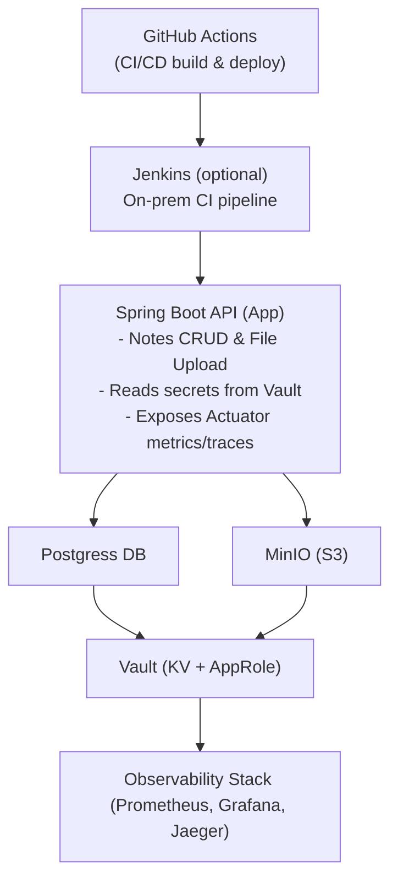
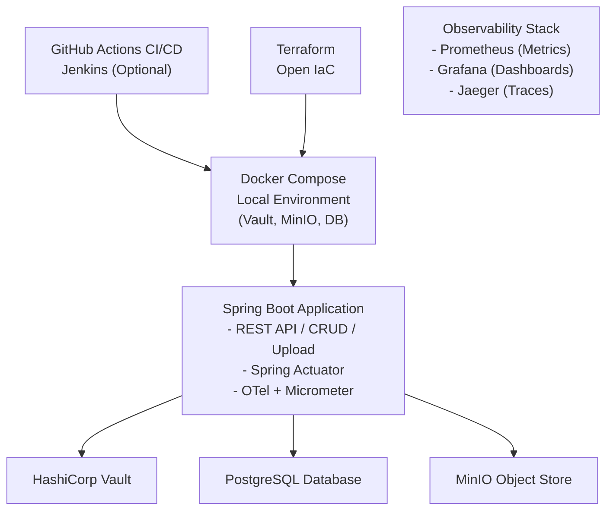
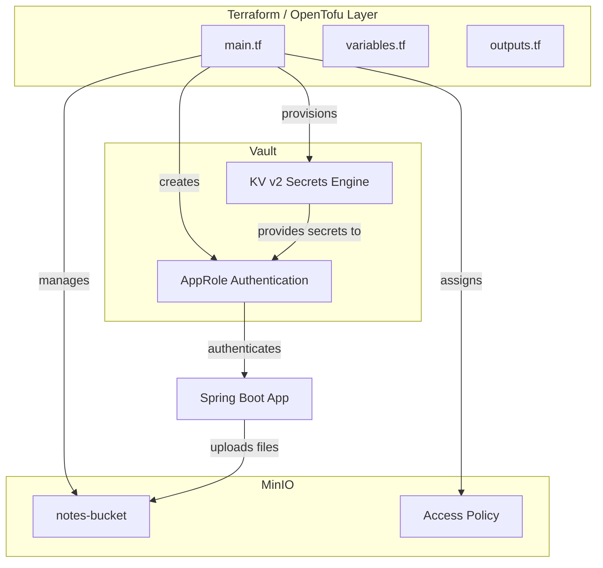
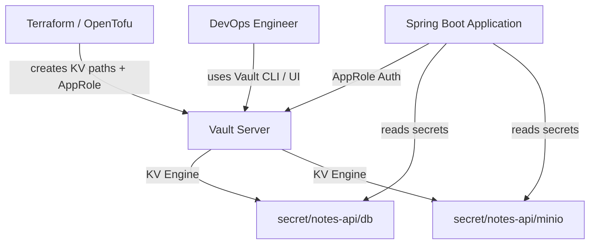
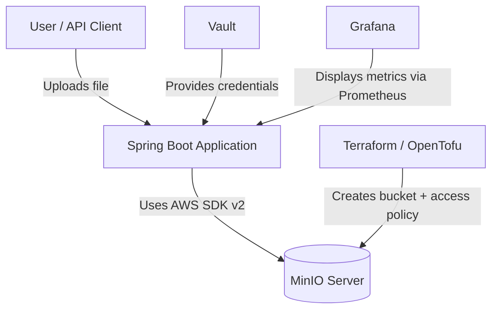
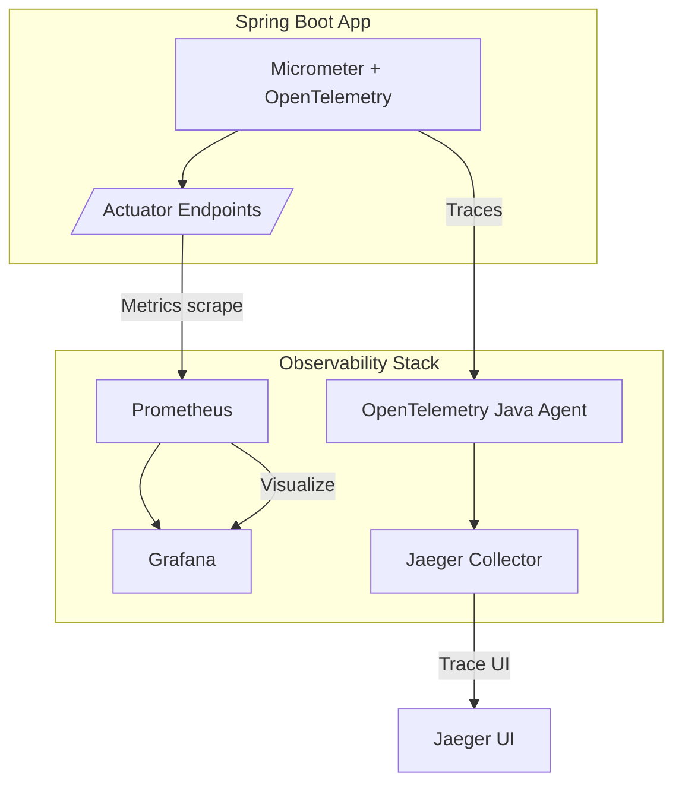
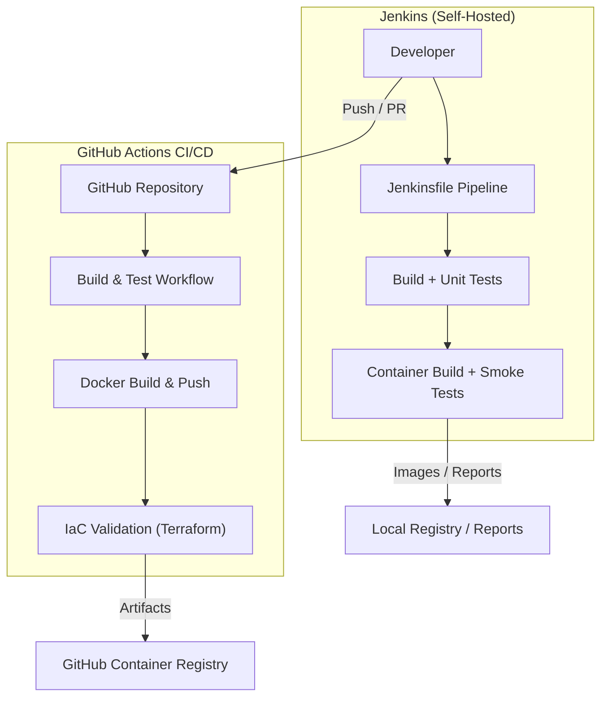
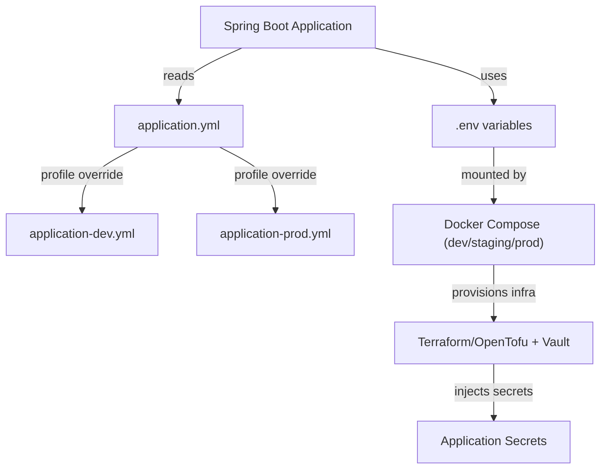
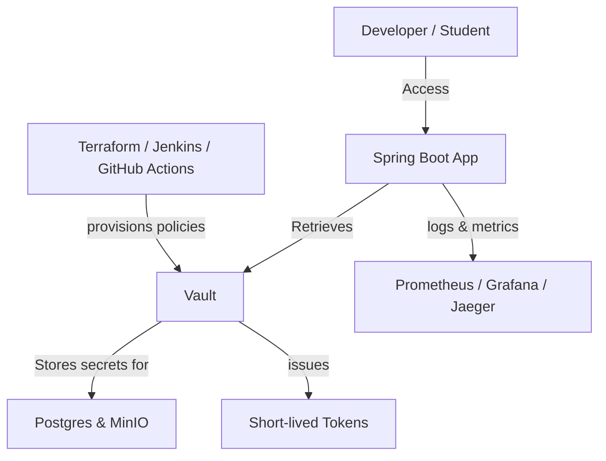
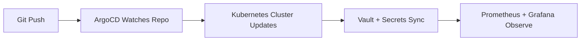


# DevOps Demo App — Secrets, Storage, IaC & Observability (Java + Spring Boot)

This repository hosts a **complete DevOps demonstration** built around a simple Java application, designed to showcase how modern teams can combine **secure secret management**, **object storage**, **infrastructure as code**, **observability**, and **continuous integration / continuous delivery** pipelines into one cohesive workflow.

The demo uses a **Spring Boot (Java 21)** application as its centerpiece, connected to:
- **HashiCorp Vault** — secure secret management (AppRole + KV v2)
- **MinIO** — S3-compatible object storage for file uploads
- **Terraform / OpenTofu** — infrastructure as code for provisioning Vault and MinIO resources
- **Prometheus + Grafana + Jaeger** — complete observability stack (metrics, dashboards, traces)
- **GitHub Actions** — primary CI/CD pipeline (build, test, containerize, validate IaC)
- **Jenkins** — optional alternative CI/CD pipeline (self-hosted example)
- **Docker Compose** — local runtime environment orchestrating all components

The goal is to offer a **production-like, reproducible lab** that runs entirely on Docker, helping engineers understand how these DevOps tools interact to build, secure, and monitor an application through the full software lifecycle.

---

## Table of Contents

1. [Project Overview](#project-overview)  
2. [Features & Tech Stack](#features--tech-stack)  
3. [Architecture](#architecture)  
4. [Repository Layout](#repository-layout)  
5. [Prerequisites](#prerequisites)  
6. [Quick Start](#quick-start)  
7. [Infrastructure as Code (Terraform/OpenTofu)](#infrastructure-as-code-terraformopentofu)  
8. [Secret Management (Vault)](#secret-management-vault)  
9. [Object Storage (MinIO)](#object-storage-minio)  
10. [Observability](#observability)  
11. [CI/CD (GitHub Actions & Jenkins)](#cicd-github-actions--jenkins)  
12. [Configuration & Environments](#configuration--environments)  
13. [Security Considerations (Dev Mode)](#security-considerations-dev-mode)  
14. [Troubleshooting](#troubleshooting)  
15. [Demo Scenarios](#demo-scenarios)  
16. [Roadmap](#roadmap)  
17. [Contributing](#contributing)  
18. [License](#license)

---

## 1. Project Overview

### 1.1 Purpose and Goals

This project demonstrates how to build a **secure, observable, and automated DevOps environment** around a modern Spring Boot application.  
The main goal is not the application itself, but the **infrastructure and process** surrounding it — showing how real-world teams integrate:

| Capability | Tool | Purpose |
|-------------|------|----------|
| **Secret Management** | HashiCorp Vault | Store and retrieve credentials (DB, MinIO keys, API tokens) securely, using the AppRole authentication method. |
| **Object Storage** | MinIO | S3-compatible storage backend used for file uploads and backups. |
| **Infrastructure as Code** | Terraform / OpenTofu | Provision and configure Vault policies, MinIO buckets, and local resources declaratively. |
| **Observability** | Prometheus + Grafana + Jaeger | Collect metrics, visualize dashboards, and trace distributed transactions. |
| **Continuous Integration / Continuous Delivery** | GitHub Actions & Jenkins | Automate builds, tests, containerization, and IaC validation through reproducible pipelines. |
| **Container Orchestration (local)** | Docker Compose | Run the full stack locally in isolated, reproducible containers. |

The system follows a “**12-factor app**” design philosophy, separating configuration and secrets from code, enforcing immutability through IaC, and instrumenting telemetry from day one.

---

### 1.2 What the Demo App Does

At its core, the demo is a **Spring Boot (Java 21)** REST API that exposes:
- **CRUD endpoints** for simple `notes` objects stored in a PostgreSQL database.  
- **File upload endpoint** that stores uploaded files in **MinIO**.  
- **Actuator endpoints** (`/actuator/health`, `/actuator/prometheus`) for health and metrics.  
- **Automatic tracing** via the OpenTelemetry Java Agent.

While intentionally minimal, it is complex enough to show how secrets, storage, and observability work together.

---

### 1.3 Why These Technologies

- **HashiCorp Vault**  
  Provides a centralized, audited way to manage dynamic or static secrets. The app authenticates using an **AppRole**, which is safer than static tokens.  
  Vault’s KV v2 engine stores credentials for the database and MinIO; Spring Cloud Vault resolves them automatically at startup.

- **MinIO**  
  A lightweight, S3-compatible service ideal for local or hybrid setups. It demonstrates how a Java service can use AWS SDK v2 clients without any changes between MinIO (dev) and AWS S3 (prod).

- **Terraform / OpenTofu**  
  Ensures repeatability of environment setup — Vault paths, policies, and MinIO buckets are defined as code and can be version-controlled.  
  OpenTofu is a fully open, drop-in alternative to Terraform, often preferred for compliance or licensing reasons.

- **Prometheus, Grafana, Jaeger**  
  Together they implement the three pillars of observability: metrics, dashboards, and traces.  
  Prometheus scrapes metrics from the Spring Boot Actuator; Grafana visualizes them; Jaeger displays distributed traces generated by OpenTelemetry.

- **GitHub Actions and Jenkins**  
  Two CI/CD examples showing complementary approaches:  
  - **GitHub Actions**: cloud-native pipeline triggered on push or PR.  
  - **Jenkins**: traditional on-premise or Docker-based automation for teams preferring self-hosted control.  
  Both run Maven builds, tests, Docker image builds, and Terraform validation.

- **Docker Compose**  
  Orchestrates all dependencies locally — database, Vault, MinIO, Prometheus, Grafana, Jaeger — enabling a full-stack environment in minutes.

---

### 1.4 High-Level Architecture



---

### 1.5 Learning Outcomes

By completing this demo, you will:
1. Understand how Spring Boot securely retrieves secrets from Vault using AppRole authentication.  
2. Learn to provision MinIO buckets and Vault secrets using Terraform/OpenTofu.  
3. Expose, scrape, and visualize metrics with Prometheus and Grafana.  
4. Collect and analyze distributed traces using the OpenTelemetry Java Agent + Jaeger.  
5. Automate build, test, and infrastructure validation through GitHub Actions workflows (and optionally Jenkins).  
6. Run the entire stack reproducibly in Docker Compose for local development and demonstration.

---

### 1.6 Component Versions (baseline 2025)

| Component | Version / Range | Notes |
|------------|----------------|-------|
| Java JDK | 21 (LTS) | Recommended runtime |
| Spring Boot | 3.3 or newer | Supports Micrometer 3 + OTel 1.x |
| HashiCorp Vault | ≥ 1.17 | KV v2 enabled |
| MinIO | RELEASE.2025-LTS | S3 API compatible |
| Terraform / OpenTofu | ≥ 1.8 | IaC engine |
| Prometheus | ≥ 2.54 | Metrics scraping |
| Grafana | ≥ 11.2 | Dashboards |
| Jaeger | ≥ 1.57 | Tracing UI |
| Docker Compose | v2.25 + | Local orchestration |
| GitHub Actions | Native | CI/CD workflow |
| Jenkins | LTS 2.479 + | Optional pipeline |

---

### 1.7 Access Points (after local startup)

| Service | URL | Default Credentials (dev mode) |
|----------|-----|--------------------------------|
| Application API | http://localhost:8080 | — |
| Actuator Health | http://localhost:8080/actuator/health | — |
| Vault UI | http://localhost:8200 | token from `bootstrap.sh` |
| MinIO Console | http://localhost:9001 | `minioadmin / minioadmin` |
| Prometheus | http://localhost:9090 | — |
| Grafana | http://localhost:3000 | `admin / admin` |
| Jaeger UI | http://localhost:16686 | — |
| Jenkins (optional) | http://localhost:8081 | set on first run |

---
## 2. Features & Tech Stack

### 2.1 Key Features

The demo application combines several DevOps disciplines into a unified example.  
Each feature has a practical implementation within the stack:

| Feature | Description | Implemented With |
|----------|--------------|-----------------|
| **Secure Secrets** | All sensitive values (database password, S3 access keys) are stored in Vault and injected dynamically at runtime. | HashiCorp Vault + Spring Cloud Vault |
| **Declarative Infrastructure** | All Vault KV paths, AppRoles, and MinIO buckets are provisioned as code, ensuring full reproducibility. | Terraform / OpenTofu |
| **File Uploads to Object Storage** | Uploaded files are stored in an S3-compatible bucket with metadata tracking. | MinIO + AWS SDK v2 |
| **Observability & Telemetry** | Metrics, traces, and health endpoints are exposed out of the box. | Spring Actuator, Micrometer, OpenTelemetry |
| **Dashboards & Metrics** | Runtime metrics and traces are collected and visualized. | Prometheus, Grafana, Jaeger |
| **Containerized Runtime** | All dependencies (Vault, MinIO, Postgres, Prometheus, etc.) are containerized and orchestrated locally. | Docker Compose |
| **Automated CI/CD** | Continuous build, test, packaging, and infrastructure validation. | GitHub Actions + Jenkins |
| **12-Factor Alignment** | Configuration through environment variables, externalized secrets, stateless build artifacts. | Spring Boot best practices |

---

### 2.2 Tech Stack Overview

#### Core Application
- **Language:** Java 21 (LTS)  
- **Framework:** Spring Boot 3.3+  
- **Build Tool:** Maven Wrapper (`./mvnw`)  
- **Runtime Packaging:** Docker image built from a multi-stage `Dockerfile`  
- **APIs:** REST (Spring Web), Actuator, S3 SDK integration  
- **Database:** PostgreSQL 15 (runs via Docker)  

#### Infrastructure Layer
- **HashiCorp Vault:**  
  - Runs locally in development mode via Docker Compose.  
  - Uses **KV v2** secrets engine for static secrets.  
  - Application authenticates via **AppRole** credentials set during bootstrap.  
- **MinIO:**  
  - Provides an **S3-compatible** endpoint for object storage.  
  - Used for file uploads, asset storage, and testing S3 SDK integrations.  
- **Terraform / OpenTofu:**  
  - Defines and provisions Vault KV paths, AppRoles, and MinIO buckets.  
  - Stored under `infra/` with reusable modules.  

#### Observability Stack
- **Prometheus:** scrapes `/actuator/prometheus` for metrics every 15 seconds.  
- **Grafana:** imports pre-built dashboards for Spring Boot + Micrometer.  
- **Jaeger:** visualizes traces emitted by the OpenTelemetry Java Agent.  
- **Micrometer + OTel:** instrumentation bridge used by Spring Boot 3.  

#### CI/CD Pipelines
- **GitHub Actions:**  
  - Triggered on every push or pull request.  
  - Runs Maven build → tests → Docker build → Terraform fmt/validate.  
  - Optionally pushes the Docker image to GitHub Container Registry.  
- **Jenkins:**  
  - Provides a self-hosted alternative pipeline using a declarative `Jenkinsfile`.  
  - Useful for on-prem or hybrid CI environments.  

#### Local Environment & Tooling
- **Docker Compose:** orchestrates all dependencies for local runs.  
- **Vault CLI & MinIO Client (`mc`):** optional for manual inspection.  
- **Prometheus UI, Grafana UI, Jaeger UI:** accessible via standard localhost ports.  

---

### 2.3 Integration Summary

| Layer | Integration Flow |
|--------|------------------|
| **Application ↔ Vault** | Spring Cloud Vault retrieves DB and MinIO credentials at startup using the AppRole auth method. |
| **Application ↔ MinIO** | Uses AWS SDK v2 S3 client (with `forcePathStyle=true`) to upload and fetch files. |
| **Application ↔ Observability Stack** | Micrometer exposes `/actuator/prometheus`; OpenTelemetry agent exports traces to Jaeger. |
| **Terraform ↔ Vault/MinIO** | IaC scripts provision secrets and storage before the application starts. |
| **CI/CD ↔ Repository** | GitHub Actions validates code, builds Docker images, and checks Terraform consistency on each commit. |

---

### 2.4 Why This Stack

- **Modern & Portable:** everything runs locally with Docker Compose, yet mirrors production-grade tooling.  
- **Secure by Design:** secrets never leave Vault; no credentials are committed.  
- **Observable from Day 1:** all telemetry layers are active by default.  
- **Automated Delivery:** continuous testing, building, and IaC validation ensure reproducibility.  
- **Educational Value:** ideal for DevOps learners who want to see a full end-to-end pipeline in action.

---

## 3. Architecture

### 3.1 System Overview

The architecture follows a modular, service-oriented design where each component has a well-defined purpose.  
All services run locally through Docker Compose, enabling rapid provisioning, clean isolation, and reproducible environments.

At a high level, the architecture consists of five logical layers:

1. **Application Layer** – The Spring Boot REST API providing CRUD operations and file upload functionality.  
2. **Secrets Layer** – HashiCorp Vault stores and serves credentials dynamically through AppRole authentication.  
3. **Storage Layer** – PostgreSQL handles relational data; MinIO provides object storage for uploaded files.  
4. **Observability Layer** – Prometheus, Grafana, and Jaeger monitor and visualize metrics, logs, and traces.  
5. **Automation Layer** – GitHub Actions and Jenkins automate build, test, packaging, and infrastructure validation.

---

### 3.2 Logical Architecture Diagram



---

### 3.3 Component Responsibilities

| Component | Responsibility |
|------------|----------------|
| **Spring Boot App** | Core business logic: CRUD endpoints, file upload, and metrics exposure. |
| **Vault** | Securely stores DB and MinIO credentials; provides AppRole authentication for the app. |
| **MinIO** | Handles object storage; receives uploads from the API using S3 SDK integration. |
| **PostgreSQL** | Persists structured data (notes, metadata, audit info). |
| **Prometheus** | Collects metrics from Spring Boot `/actuator/prometheus`. |
| **Grafana** | Visualizes runtime metrics and dashboards. |
| **Jaeger** | Displays request traces collected via OpenTelemetry agent. |
| **Terraform/OpenTofu** | Provisions Vault KV paths, AppRoles, and MinIO buckets. |
| **GitHub Actions / Jenkins** | Automates build, test, and infrastructure validation pipelines. |
| **Docker Compose** | Orchestrates all containers locally for seamless integration testing. |

---

### 3.4 Data Flow Summary

1. **Application Startup**  
   - Spring Boot loads configuration from Vault using AppRole authentication.  
   - Secrets are injected into the environment before the data source and S3 clients initialize.

2. **Runtime Operations**  
   - User interacts with API (e.g., creates a note or uploads a file).  
   - The request is logged, traced, and metrics are updated automatically.  
   - Files are pushed to MinIO via AWS SDK, while note metadata is stored in PostgreSQL.

3. **Observability Collection**  
   - Metrics are scraped periodically by Prometheus.  
   - Traces are exported to Jaeger via the OpenTelemetry Java Agent.  
   - Grafana visualizes metrics and trace correlations.

4. **Automation & CI/CD**  
   - Every code push triggers GitHub Actions (or Jenkins) to:  
     a. Build and test the application.  
     b. Build and optionally push Docker images.  
     c. Validate Terraform syntax and plan changes.  
   - This ensures full reproducibility and compliance before deployment.

---

### 3.5 Security & Isolation Model

- **Vault Tokens:** Never hardcoded; AppRole credentials are bootstrapped via Terraform.  
- **Network Isolation:** Containers communicate through internal Docker networks; only essential ports are exposed.  
- **Principle of Least Privilege:** Vault policies grant only the required read access for specific secret paths.  
- **Separation of Concerns:** Application, monitoring, and automation layers remain independent and replaceable.  

---

### 3.6 Key Benefits of This Architecture

- ✅ **Reproducibility:** Infrastructure and configuration can be rebuilt at any time using Terraform + Docker Compose.  
- 🔒 **Security by Default:** No credentials stored in code or environment files.  
- 📊 **Observability Built-In:** Metrics, traces, and dashboards from the first commit.  
- ⚙️ **Automation-Ready:** GitHub Actions & Jenkins pipelines validate every change automatically.  
- ☁️ **Cloud-Agnostic:** Can be easily migrated to Kubernetes or cloud-native equivalents (Vault, S3, Prometheus).  

---
## 4. Repository Layout

### 4.1 Folder Structure

The project follows a clear modular structure that separates application code, infrastructure configuration, observability assets, and automation workflows.

```
demos/secure-springboot-minio/
├── app/                     # Core Spring Boot application
│   ├── src/main/java/...    # Java sources (controllers, services, configs)
│   ├── src/main/resources/  # Application configs, templates, static files
│   ├── Dockerfile           # Multi-stage build image for the app
│   └── pom.xml              # Maven project descriptor
│
├── infra/                   # Infrastructure as Code (Terraform / OpenTofu)
│   ├── main.tf              # Root module (Vault + MinIO resources)
│   ├── variables.tf         # Input variables
│   ├── outputs.tf           # Output references (Vault tokens, etc.)
│   ├── terraform.tfvars     # Local variable values (excluded from repo)
│   └── README.md            # Infra-specific documentation
│
├── docker/                  # Local runtime environment
│   ├── docker-compose.yml   # Main orchestrator (Vault, MinIO, DB, Grafana, etc.)
│   ├── prometheus.yml       # Prometheus scrape configuration
│   ├── grafana/
│   │   ├── dashboards/      # Prebuilt dashboards for Spring metrics
│   │   └── provisioning/    # Datasource definitions for Grafana
│   └── jaeger/              # Optional Jaeger collector configs
│
├── otel/                    # OpenTelemetry configuration
│   └── opentelemetry-javaagent.jar  # Java agent for tracing
│
├── scripts/                 # Helper scripts for local setup
│   ├── bootstrap.sh         # Seeds Vault and MinIO (dev mode)
│   ├── teardown.sh          # Clean environment shutdown
│   └── verify.sh            # Validation checks for running stack
│
├── .github/workflows/       # GitHub Actions pipelines
│   └── ci.yml               # CI workflow (build, test, Docker, IaC validation)
│
├── Jenkinsfile              # Alternative pipeline definition (optional)
├── .env.example             # Example environment variables file
├── .gitignore               # Ignored files and directories
├── README.md                # Main documentation
└── LICENSE                  # License information
```

---

### 4.2 Directory Responsibilities

| Directory | Purpose |
|------------|----------|
| **app/** | Contains the Spring Boot REST API codebase. It connects to Vault for secrets, MinIO for file storage, and exposes observability endpoints. |
| **infra/** | Infrastructure provisioning via Terraform/OpenTofu. Defines Vault policies, AppRoles, MinIO buckets, and seed secrets. |
| **docker/** | Local environment definition — all supporting services run here for reproducible DevOps experiments. |
| **otel/** | Stores the OpenTelemetry Java agent used to collect traces. |
| **scripts/** | Convenience scripts for bootstrapping and verifying the environment. |
| **.github/workflows/** | CI/CD pipeline definition using GitHub Actions. |
| **Jenkinsfile** | Defines an optional Jenkins-based CI pipeline mirroring GitHub Actions. |

---

### 4.3 Environment Files and Configuration

- **.env.example** — Template file showing environment variables such as Vault address, MinIO endpoint, and access keys.  
  Developers can duplicate it to `.env` and adjust values for local runs.  
- **application.yml** — Default Spring Boot configuration that references environment variables or Vault paths.  
- **application-local.yml** — Overrides for local development profile.  
- **prometheus.yml** — Defines scrape targets for the Prometheus instance.  
- **grafana/provisioning/** — Automatically sets up Prometheus as a data source and imports dashboards on startup.

---

### 4.4 CI/CD and Automation Files

- **.github/workflows/ci.yml** — GitHub Actions pipeline that:  
  1. Checks out the repo.  
  2. Builds and tests the app with Maven.  
  3. Builds the Docker image and (optionally) pushes it to GitHub Container Registry.  
  4. Runs Terraform format and validation checks.  

- **Jenkinsfile** — Equivalent declarative pipeline for self-hosted setups. It includes `Checkout → Build → Test → Deploy` stages, mirroring the GitHub workflow.

- **scripts/bootstrap.sh** — Automatically configures Vault (AppRole, KV secrets) and MinIO (bucket creation) to reduce manual setup effort.

---

### 4.5 Best Practices Adopted

- **Separation of concerns:** Application, infrastructure, and automation live in distinct directories.  
- **Reproducibility:** Every environment can be rebuilt from scratch using Docker Compose and Terraform.  
- **Version control hygiene:** Sensitive files (`terraform.tfvars`, `.env`, Vault tokens) are excluded via `.gitignore`.  
- **Documentation-first:** Each major component (infra, app) includes a lightweight README for onboarding new contributors.

---
## 5. Prerequisites

### 5.1 Overview

Before running the demo, you’ll need to prepare a few essential tools and dependencies on your system.  
This section provides clear installation steps, verified tutorial links, and setup commands for each technology used in the stack.

All components can be installed on **Linux**, **macOS**, or **Windows (WSL2)**.  
If you’re using **WSL2**, ensure that Docker is configured to expose the Linux engine to your distribution.

---

### 5.2 Required Tools

| Tool | Purpose | Recommended Version | Installation Guide |
|------|----------|---------------------|--------------------|
| **JDK (Java Development Kit)** | Required to build and run the Spring Boot app | 21 (LTS) | [Install Java 21](https://adoptium.net/temurin/releases/?version=21) |
| **Maven Wrapper (`mvnw`)** | Build automation for the Java project | 3.9+ | [Maven Getting Started](https://maven.apache.org/install.html) |
| **Docker & Docker Compose** | Run all services locally in containers | Docker Engine ≥ 24.0, Compose v2.25+ | [Docker Installation Guide](https://docs.docker.com/get-docker/) |
| **Terraform or OpenTofu** | Provision Vault and MinIO resources as code | Terraform ≥ 1.8 / OpenTofu ≥ 1.8 | [Terraform Install](https://developer.hashicorp.com/terraform/tutorials/aws-get-started/install-cli) / [OpenTofu Install](https://opentofu.org/docs/intro/install/) |
| **HashiCorp Vault** | Manage secrets and AppRoles | Vault ≥ 1.17 | [Vault Installation](https://developer.hashicorp.com/vault/tutorials/getting-started/install-tools) |
| **MinIO** | Local object storage compatible with S3 | RELEASE.2025-LTS | [MinIO Quickstart](https://min.io/docs/minio/linux/index.html) |
| **Prometheus** | Collect metrics from Spring Boot | ≥ 2.54 | [Prometheus Download](https://prometheus.io/download/) |
| **Grafana** | Visualize Prometheus metrics | ≥ 11.2 | [Grafana Install](https://grafana.com/docs/grafana/latest/setup-grafana/installation/) |
| **Jaeger** | Display traces exported via OpenTelemetry | ≥ 1.57 | [Jaeger Getting Started](https://www.jaegertracing.io/docs/latest/getting-started/) |
| **GitHub Account (optional)** | Required for CI/CD pipeline integration | — | [GitHub Actions Documentation](https://docs.github.com/en/actions) |
| **Jenkins (optional)** | Local or on-prem CI/CD server | LTS 2.479+ | [Jenkins Installation Guide](https://www.jenkins.io/doc/book/installing/) |

---

### 5.3 Optional Tools

| Tool | Use Case | Installation |
|------|-----------|--------------|
| **MinIO Client (`mc`)** | CLI for interacting with MinIO buckets | [MinIO Client Install](https://min.io/docs/minio/linux/reference/minio-mc.html) |
| **Vault CLI** | Manual secret management and debugging | [Vault CLI Reference](https://developer.hashicorp.com/vault/docs/commands) |
| **HTTPie / curl** | Testing API endpoints | [HTTPie Install](https://httpie.io/docs/cli/installation) |
| **Visual Studio Code / IntelliJ IDEA** | Development environment | [VS Code Download](https://code.visualstudio.com/) / [IntelliJ IDEA Download](https://www.jetbrains.com/idea/download/) |

---

### 5.4 Environment Recommendations

- **Operating System:** Linux (Ubuntu 22.04+), macOS 13+, or Windows 11 with WSL2.  
- **RAM:** Minimum 8 GB (12 GB recommended for full stack with observability).  
- **CPU:** Dual-core or higher.  
- **Disk Space:** ~5 GB free for Docker images and dependencies.

---

### 5.5 Verifying Installations

After installing all dependencies, verify them with the following commands:

```bash
# Check Java and Maven
java -version
./mvnw -v

# Check Docker and Compose
docker --version
docker compose version

# Check Terraform or OpenTofu
terraform -version   # or tofu -version

# Check Vault
vault version

# Check MinIO (if running)
mc --version

# Check Prometheus, Grafana, and Jaeger (optional)
prometheus --version
grafana-server -v
```

If all commands return version numbers successfully, your environment is ready for the next step.

---

### 5.6 Next Steps

Once your local environment is set up:
1. Clone the repository.  
2. Start the local Docker Compose stack (`docker compose up -d`).  
3. Use the `scripts/bootstrap.sh` script to seed Vault and MinIO.  
4. Launch the Spring Boot app (`./mvnw spring-boot:run`).

You can then access all services from your browser (see the *Access Points* table in Chapter 1).

---
## 6. Quick Start

### 6.1 Overview

This chapter walks you through bringing up the entire stack in under **10 minutes**, using **Docker Compose** and **Terraform/OpenTofu**.  
By the end of this guide, you’ll have all services running locally, secrets seeded in Vault, a working Spring Boot API, and live observability dashboards.

---

### 6.2 Clone the Repository

```bash
git clone https://github.com/<your-org-or-username>/secure-springboot-minio.git
cd secure-springboot-minio
```

> Replace `<your-org-or-username>` with your actual GitHub account or organization.

---

### 6.3 Bring Up the Infrastructure Stack

Use Docker Compose to start all dependencies: PostgreSQL, Vault, MinIO, Prometheus, Grafana, and Jaeger.

```bash
cd docker
docker compose up -d
```

Wait for a few seconds, then verify everything is running:

```bash
docker ps --format "table {{.Names}}	{{.Status}}	{{.Ports}}"
```

You should see containers for:
- `vault`, `minio`, `postgres`, `prometheus`, `grafana`, `jaeger`, and optionally `jenkins`.

---

### 6.4 Initialize and Seed Vault + MinIO

Before starting the app, secrets and storage buckets must be configured.  
A helper script is provided under `scripts/bootstrap.sh`.

```bash
chmod +x scripts/bootstrap.sh
./scripts/bootstrap.sh
```

This script performs:
1. Unseals and logs into Vault (dev mode).  
2. Enables KV v2 secrets engine.  
3. Creates `AppRole` for the Spring Boot app.  
4. Seeds secrets under:
   - `secret/notes-api/db`
   - `secret/notes-api/minio`
5. Creates a MinIO bucket (`notes-bucket`) and assigns basic policies.

If you prefer manual configuration, check the detailed commands in `scripts/bootstrap.sh` or Vault CLI reference.

---

### 6.5 Apply Terraform / OpenTofu Configuration

If you want to manage the same setup declaratively, run the following instead of the script:

```bash
cd infra
terraform init      # or tofu init
terraform apply -auto-approve
```

This will create the same KV paths and MinIO resources as defined in `main.tf`.

---

### 6.6 Run the Spring Boot Application

Once the infrastructure is ready, start the app:

```bash
cd app
./mvnw spring-boot:run
```

You’ll see logs indicating:
- The app successfully connected to **Vault** via AppRole.  
- Secrets were injected for DB and MinIO.  
- The API and Actuator endpoints are available.

Access points:

| Service | URL |
|----------|-----|
| Application API | http://localhost:8080 |
| Actuator Health | http://localhost:8080/actuator/health |
| Prometheus | http://localhost:9090 |
| Grafana | http://localhost:3000 |
| Jaeger UI | http://localhost:16686 |
| Vault UI | http://localhost:8200 |
| MinIO Console | http://localhost:9001 |

---

### 6.7 Test the Endpoints

Create a simple note:

```bash
curl -X POST http://localhost:8080/notes   -H "Content-Type: application/json"   -d '{"title":"first note","content":"hello world"}'
```

Upload a file to MinIO through the API:

```bash
curl -F "file=@README.md" http://localhost:8080/files
```

Check the health endpoint:

```bash
curl http://localhost:8080/actuator/health
```

If everything is configured correctly, you’ll see responses confirming the database and storage connections.

---

### 6.8 View Metrics and Traces

1. **Prometheus** – Open `http://localhost:9090` and confirm the `notes-api` target is `UP`.  
2. **Grafana** – Visit `http://localhost:3000` (default credentials `admin/admin`).  
   - Import or view the *Spring Boot Metrics* dashboard.  
3. **Jaeger** – Visit `http://localhost:16686` and search for service `notes-api` to view request traces.

---

### 6.9 Stop the Environment

When you’re done testing, gracefully shut down all containers:

```bash
docker compose down
```

If you wish to clear persistent volumes as well:

```bash
docker compose down -v
```

---

### 6.10 Troubleshooting Quick Setup

| Issue | Possible Cause | Fix |
|--------|----------------|-----|
| App cannot connect to Vault | Vault not initialized or AppRole missing | Run `scripts/bootstrap.sh` again or reapply Terraform |
| MinIO “Access Denied” | Bucket not created or wrong credentials | Check `scripts/bootstrap.sh` or re-run Terraform |
| Prometheus target “DOWN” | App not started | Verify app logs and restart it |
| Grafana login fails | Wrong password | Default: `admin / admin` |
| Docker ports busy | Another service running | Stop other containers or modify ports in `docker-compose.yml` |

---

### 6.11 Verification Checklist

✅ All Docker containers are up and healthy  
✅ Vault UI accessible and secrets present under `secret/notes-api/`  
✅ MinIO console reachable, `notes-bucket` exists  
✅ Spring Boot API responds to `/notes`  
✅ Prometheus shows targets as “UP”  
✅ Grafana displays metrics dashboard  
✅ Jaeger traces visible for API calls  

---
## 7. Infrastructure as Code (Terraform / OpenTofu)

### 7.1 Overview

The **Infrastructure as Code (IaC)** layer is responsible for provisioning and configuring all supporting services — such as **Vault**, **MinIO**, and **PostgreSQL** resources — automatically.  
By codifying the infrastructure, the environment can be rebuilt, versioned, and maintained in a consistent manner across all team members and deployment stages.

Both **Terraform** and **OpenTofu** are supported. OpenTofu is the community-driven, open-source fork of Terraform that is 100% syntax-compatible.

---

### 7.2 Architecture Diagram (Mermaid)



---

### 7.3 Terraform Directory Structure

```
infra/
├── main.tf             # Root configuration (Vault + MinIO provisioning)
├── variables.tf        # Input variables for Vault address, tokens, etc.
├── outputs.tf          # Exports for generated AppRole credentials
├── providers.tf        # Providers for Vault and MinIO
├── terraform.tfvars    # Local variable definitions (ignored by Git)
└── README.md           # Documentation for infrastructure setup
```

---

### 7.4 Example: main.tf

Below is a simplified example of what the Terraform configuration looks like:

```hcl
terraform {
  required_providers {
    vault = {
      source  = "hashicorp/vault"
      version = ">= 3.20"
    }
    minio = {
      source  = "aminueza/minio"
      version = ">= 2.0"
    }
  }
}

provider "vault" {
  address = var.vault_addr
  token   = var.vault_token
}

provider "minio" {
  minio_server   = var.minio_server
  minio_user     = var.minio_user
  minio_password = var.minio_password
}

# Create a KV secret path for the Spring Boot app
resource "vault_kv_secret_v2" "db" {
  mount     = "secret"
  name      = "notes-api/db"
  data_json = jsonencode({ DB_PASSWORD = "secure-password" })
}

# Create a MinIO bucket for uploaded files
resource "minio_s3_bucket" "notes" {
  bucket = "notes-bucket"
  acl    = "public"
}

# Create a Vault AppRole for the Spring Boot app
resource "vault_approle_auth_backend_role" "notes_app" {
  backend   = "approle"
  role_name = "notes-app-role"
  policies  = ["default"]
}
```

---

### 7.5 Variables and Outputs

**variables.tf**
```hcl
variable "vault_addr" {
  description = "Address of the Vault server"
  type        = string
  default     = "http://127.0.0.1:8200"
}

variable "vault_token" {
  description = "Vault root token (for setup only)"
  type        = string
}

variable "minio_server" {
  description = "URL of MinIO endpoint"
  type        = string
  default     = "http://127.0.0.1:9000"
}
```

**outputs.tf**
```hcl
output "vault_role_id" {
  description = "AppRole Role ID for the Spring Boot app"
  value       = vault_approle_auth_backend_role.notes_app.role_id
}

output "vault_secret_id" {
  description = "AppRole Secret ID for the Spring Boot app"
  value       = vault_approle_auth_backend_role_secret_id.notes_app.secret_id
  sensitive   = true
}
```

---

### 7.6 Running the IaC Setup

1. **Navigate to the infra directory:**
   ```bash
   cd infra
   ```

2. **Initialize providers:**
   ```bash
   terraform init
   ```
   or, if using OpenTofu:
   ```bash
   tofu init
   ```

3. **Review the plan:**
   ```bash
   terraform plan
   ```

4. **Apply changes:**
   ```bash
   terraform apply -auto-approve
   ```

5. **Verify outputs:**
   ```bash
   terraform output
   ```

After successful execution, you’ll have:
- `notes-bucket` created in MinIO
- `secret/notes-api` path in Vault with DB and MinIO credentials
- A new AppRole with generated Role ID and Secret ID

---

### 7.7 Best Practices

| Area | Recommendation |
|------|----------------|
| **State management** | Use remote backends (e.g., S3 + DynamoDB, or MinIO) for shared teams. |
| **Sensitive data** | Use Vault or environment variables, never commit plaintext tokens. |
| **Idempotency** | Always re-run `plan` before `apply` to verify drift. |
| **Version control** | Keep IaC in its own directory with clear module structure. |
| **Provider pinning** | Lock provider versions for reproducibility. |
| **Secrets rotation** | Regularly rotate Vault tokens and reapply configuration. |

---

### 7.8 Troubleshooting

| Problem | Cause | Solution |
|----------|--------|----------|
| `Error 403: permission denied` | Invalid Vault token or missing policy | Check your token or policy path |
| `bucket already exists` | Previous bucket not destroyed | Run `terraform destroy` or rename the bucket |
| `provider not found` | Missing plugin binary | Run `terraform init` again |
| `no outputs found` | Plan not applied | Ensure you’ve executed `terraform apply` |

---
## 8. Secret Management (Vault)

### 8.1 Overview

**HashiCorp Vault** provides centralized, secure, and auditable secret management for applications and infrastructure.  
In this demo, Vault is responsible for storing sensitive configuration such as:

- Database credentials (PostgreSQL username and password)  
- MinIO access and secret keys  
- Application-level secrets used by the Spring Boot service  

Vault runs locally in **dev mode** for demonstration purposes, but the same configuration can easily be extended to production setups using persistent storage and access control policies.

---

### 8.2 Vault Architecture Diagram (Mermaid)



---

### 8.3 Vault Configuration

Vault is started automatically by Docker Compose using the official image.  
A simplified configuration (`config.hcl`) is used for dev mode:

```hcl
storage "file" {
  path = "/vault/file"
}

listener "tcp" {
  address     = "0.0.0.0:8200"
  tls_disable = 1
}

ui = true
disable_mlock = true
api_addr = "http://127.0.0.1:8200"
```

This allows Vault’s web UI and API to be accessible at [http://localhost:8200](http://localhost:8200).

---

### 8.4 Secrets Engine Structure

Vault uses the **KV v2** engine for static secret storage.  
In this demo, the following structure is created automatically via Terraform or `bootstrap.sh`:

```
secret/
└── notes-api/
    ├── db/
    │   └── DB_PASSWORD = "secure-password"
    └── minio/
        ├── S3_ACCESS_KEY = "minioadmin"
        └── S3_SECRET_KEY = "minioadmin"
```

---

### 8.5 Authentication: AppRole

The **AppRole authentication method** is used to allow the Spring Boot app to retrieve secrets programmatically.

#### Conceptual Flow
1. Terraform or the bootstrap script creates an AppRole (e.g., `notes-app-role`).  
2. Vault generates two values:
   - `role_id` (public, identifies the role)
   - `secret_id` (private, like a password)  
3. The Spring Boot app sends both to Vault’s `/v1/auth/approle/login` endpoint to obtain a temporary client token.  
4. The token is then used to read secrets under `secret/notes-api/*`.

#### Example (CLI)
```bash
vault write auth/approle/role/notes-app-role     policies="default"     token_ttl=1h     token_max_ttl=4h

vault read auth/approle/role/notes-app-role/role-id
vault write -f auth/approle/role/notes-app-role/secret-id
```

---

### 8.6 Spring Boot Integration

Spring Boot integrates with Vault using **Spring Cloud Vault**.

`application.yml` example:

```yaml
spring:
  application:
    name: notes-api
  cloud:
    vault:
      uri: http://127.0.0.1:8200
      authentication: APPROLE
      app-role:
        role-id: ${VAULT_ROLE_ID}
        secret-id: ${VAULT_SECRET_ID}
      kv:
        enabled: true
        backend: secret
        application-name: notes-api
```

Environment variables are set automatically via Terraform outputs or `.env`:

```bash
export VAULT_ROLE_ID=<generated-role-id>
export VAULT_SECRET_ID=<generated-secret-id>
```

When the application starts, Spring Cloud Vault automatically authenticates and injects the secrets as properties (e.g., `${DB_PASSWORD}`, `${S3_ACCESS_KEY}`).

---

### 8.7 Vault CLI Basics

You can interact with Vault manually for debugging or inspection.

```bash
# Log in with token
vault login <root_token>

# List all secrets
vault kv list secret/

# Read secret data
vault kv get secret/notes-api/db

# Write or update a secret
vault kv put secret/notes-api/db DB_PASSWORD=newpass123
```

---

### 8.8 Security Recommendations

| Area | Recommendation |
|------|----------------|
| **Tokens** | Use short-lived tokens and never store them in code. |
| **AppRole IDs** | Distribute `role_id` and `secret_id` securely via CI/CD or env vars. |
| **Audit Logs** | Enable Vault’s audit backend to track every secret access. |
| **Policies** | Use least privilege: the app role should only read its own secrets. |
| **Environment Files** | Avoid committing `.env` files; use examples only. |

---

### 8.9 Troubleshooting

| Problem | Cause | Solution |
|----------|--------|----------|
| `403 permission denied` | Wrong policy or path | Check Vault policy assigned to AppRole |
| `connection refused` | Vault container not running | Run `docker ps` and ensure Vault is up |
| `missing secret_id` | Terraform output not exported | Re-run `terraform apply` or `bootstrap.sh` |
| `Spring app fails to start` | Invalid credentials or path mismatch | Verify `application.yml` Vault paths |

---

### 8.10 Verification Steps

After Vault is running and seeded:
1. Visit **[http://localhost:8200](http://localhost:8200)**.  
2. Log in with the token printed by `bootstrap.sh` or Terraform output.  
3. Navigate to **Secrets → secret → notes-api**.  
4. Confirm entries for `db` and `minio` exist.  
5. Restart the Spring Boot app and check successful secret retrieval in the logs.

---
## 9. Object Storage (MinIO)

### 9.1 Overview

**MinIO** is a high-performance, S3-compatible object storage solution used in this project to demonstrate secure file handling within a local DevOps environment.  
The Spring Boot application uploads and retrieves files through MinIO using the **AWS SDK for Java v2**, leveraging credentials securely injected from **Vault**.

This setup mirrors real-world S3 integrations (e.g., AWS S3, DigitalOcean Spaces) while remaining fully local and reproducible.

---

### 9.2 Architecture Diagram (Mermaid)



---

### 9.3 MinIO Setup

The MinIO service runs as part of the Docker Compose environment and exposes two ports:

| Port | Purpose |
|------|----------|
| `9000` | S3-compatible API endpoint |
| `9001` | Web-based admin console |

You can access the console at:  
👉 [http://localhost:9001](http://localhost:9001)

**Default credentials (for local use only):**
```
Username: minioadmin
Password: minioadmin
```

---

### 9.4 Bucket Provisioning

Buckets are provisioned automatically through **Terraform** or the **bootstrap script**:

```hcl
resource "minio_s3_bucket" "notes" {
  bucket = "notes-bucket"
  acl    = "public"
}

resource "minio_iam_user" "notes_user" {
  name          = "notes-api-user"
  force_destroy = true
}

resource "minio_iam_user_policy_attachment" "notes_policy" {
  user_name  = minio_iam_user.notes_user.name
  policy_name = "readwrite"
}
```

Alternatively, you can create a bucket manually using the **MinIO Client (`mc`)**:

```bash
mc alias set local http://127.0.0.1:9000 minioadmin minioadmin
mc mb local/notes-bucket
mc policy set public local/notes-bucket
```

---

### 9.5 Application Integration

The Spring Boot application uses the **AWS S3 SDK v2**, configured via properties loaded from Vault:

```yaml
app:
  s3:
    endpoint: http://127.0.0.1:9000
    bucket: notes-bucket
    accessKey: ${S3_ACCESS_KEY}
    secretKey: ${S3_SECRET_KEY}
```

Java configuration bean example:

```java
@Bean
public S3Client s3Client(
    @Value("${app.s3.endpoint}") URI endpoint,
    @Value("${app.s3.accessKey}") String accessKey,
    @Value("${app.s3.secretKey}") String secretKey) {

    return S3Client.builder()
        .endpointOverride(endpoint)
        .credentialsProvider(
            StaticCredentialsProvider.create(
                AwsBasicCredentials.create(accessKey, secretKey)))
        .region(Region.US_EAST_1)
        .forcePathStyle(true)
        .build();
}
```

This client enables full S3 operations, including uploads, downloads, and metadata queries.

---

### 9.6 File Upload API Example

Example controller method in `FileController.java`:

```java
@PostMapping("/files")
public ResponseEntity<String> uploadFile(@RequestParam("file") MultipartFile file) {
    String key = UUID.randomUUID() + "_" + file.getOriginalFilename();

    s3Client.putObject(PutObjectRequest.builder()
            .bucket(bucketName)
            .key(key)
            .contentType(file.getContentType())
            .build(),
        RequestBody.fromBytes(file.getBytes()));

    return ResponseEntity.ok("File uploaded: " + key);
}
```

Test upload with curl:

```bash
curl -F "file=@README.md" http://localhost:8080/files
```

Then verify the uploaded file via MinIO console or `mc ls local/notes-bucket`.

---

### 9.7 Observability and Monitoring

- **Prometheus** automatically scrapes application metrics, including file upload performance.  
- **Grafana** visualizes throughput, latency, and object count over time.  
- You can extend the dashboards to include **MinIO-specific metrics** using its built-in `/minio/v2/metrics/cluster` endpoint.

---

### 9.8 Security Considerations

| Concern | Recommendation |
|----------|----------------|
| **Access Keys** | Never store access keys directly in the codebase. Always retrieve them from Vault. |
| **Bucket Policy** | Use private buckets in production; public access only for demo. |
| **Encryption** | Enable SSE (Server-Side Encryption) or client-side encryption for sensitive data. |
| **Auditing** | Use MinIO audit logs or Vault audit devices for traceability. |

---

### 9.9 Troubleshooting

| Issue | Cause | Solution |
|-------|--------|----------|
| `Access Denied` | Invalid credentials or bucket policy | Check Vault secrets and bucket ACLs |
| `NoSuchBucket` | Bucket not created | Re-run Terraform or bootstrap script |
| File not visible in console | Upload successful but cached | Refresh MinIO web console |
| Upload fails with SSL error | Wrong endpoint URL | Use `http://127.0.0.1:9000` (non-HTTPS) for local runs |

---

### 9.10 Validation Checklist

✅ MinIO console accessible at `localhost:9001`  
✅ `notes-bucket` created and visible  
✅ Spring Boot app can upload files successfully  
✅ Uploaded files appear in the bucket  
✅ Vault-injected credentials confirmed in application logs  

---
## 10. Observability

### 10.1 Overview

Observability is a core aspect of this demo. It ensures that the Spring Boot application and supporting services are **measurable, monitorable, and traceable** across the stack.  
This chapter introduces the **Prometheus**, **Grafana**, and **Jaeger** integration for metrics, dashboards, and distributed tracing.

---

### 10.2 Observability Architecture (Mermaid)



---

### 10.3 Components Overview

| Tool | Role | Integration Point |
|------|------|------------------|
| **Prometheus** | Time-series database collecting metrics from Spring Boot’s `/actuator/prometheus`. | Configured via Docker Compose and `prometheus.yml`. |
| **Grafana** | Dashboard visualization for Prometheus metrics. | Connects automatically to Prometheus as a data source. |
| **Jaeger** | Distributed tracing system for visualizing request flows. | Receives traces via OpenTelemetry Java Agent. |
| **Micrometer + Actuator** | Instrumentation layer within Spring Boot for collecting system and application metrics. | Exposes metrics to Prometheus. |
| **OpenTelemetry Java Agent** | Captures traces automatically, no code modification required. | Exports traces via OTLP to Jaeger. |

---

### 10.4 Prometheus Configuration

Prometheus is configured via the file `docker/prometheus.yml`:

```yaml
global:
  scrape_interval: 15s

scrape_configs:
  - job_name: 'notes-api'
    metrics_path: '/actuator/prometheus'
    static_configs:
      - targets: ['app:8080']
```

This setup instructs Prometheus to scrape metrics from the Spring Boot container every 15 seconds.

You can access the Prometheus UI at:  
👉 [http://localhost:9090](http://localhost:9090)

---

### 10.5 Grafana Dashboards

Grafana is automatically configured using provisioning files located in:

```
docker/grafana/
├── dashboards/
│   └── spring-boot-metrics.json
└── provisioning/
    ├── datasources/
    │   └── prometheus.yml
    └── dashboards/
        └── dashboards.yml
```

**Default credentials:**
```
Username: admin
Password: admin
```

Visit Grafana at [http://localhost:3000](http://localhost:3000).  
Once logged in, you can visualize CPU usage, JVM memory, HTTP latency, and custom app metrics.

---

### 10.6 Distributed Tracing with Jaeger

Jaeger provides end-to-end visibility for requests within the application.

**OpenTelemetry Java Agent Integration:**  
To enable tracing, the app is started with the agent attached:

```bash
JAVA_TOOL_OPTIONS="-javaagent:./otel/opentelemetry-javaagent.jar" OTEL_EXPORTER_OTLP_ENDPOINT="http://localhost:4317" OTEL_SERVICE_NAME="notes-api" ./mvnw spring-boot:run
```

This configuration sends trace data to Jaeger using the **OTLP protocol**.

Access the Jaeger UI at:  
👉 [http://localhost:16686](http://localhost:16686)

**To view traces:**
1. Select the service `notes-api`.  
2. Run a few API requests (e.g., `POST /notes`).  
3. Refresh Jaeger to visualize the trace spans.

---

### 10.7 Metrics and Traces in Action

**Metrics Examples:**
- `http_server_requests_seconds_count` — count of all HTTP requests.  
- `jvm_memory_used_bytes` — current JVM memory usage.  
- `system_cpu_usage` — CPU load of the container.

**Trace Examples:**
- Request flow across application layers (controller → service → repository).  
- File upload operations (network + S3 latency).  
- Database query timings.

---

### 10.8 Custom Application Metrics

You can easily define additional metrics in Spring Boot using Micrometer:

```java
@Component
public class FileUploadMetrics {
    private final Counter uploadCounter;

    public FileUploadMetrics(MeterRegistry registry) {
        uploadCounter = Counter.builder("app.file.uploads.total")
                .description("Number of uploaded files")
                .register(registry);
    }

    public void increment() {
        uploadCounter.increment();
    }
}
```

This custom metric will automatically appear in Prometheus and Grafana.

---

### 10.9 Example Grafana Panels

1. **API Performance Dashboard**  
   - Latency histogram (P50, P95, P99) for `http_server_requests_seconds`.  
2. **System Resource Dashboard**  
   - CPU, memory, and thread pool usage per container.  
3. **Business Metric Dashboard**  
   - Custom metrics like `app.file.uploads.total` for tracking user behavior.

---

### 10.10 Troubleshooting

| Issue | Cause | Solution |
|-------|--------|----------|
| Prometheus target “DOWN” | Application not yet started | Start the app before Prometheus scrapes |
| Grafana shows “No data” | Wrong datasource link | Check provisioning file or re-import dashboard |
| No traces in Jaeger | Missing OpenTelemetry agent | Ensure agent JAR is present and OTEL env vars are set |
| High cardinality warning | Too many label variations | Optimize metric naming and reduce dynamic labels |

---

### 10.11 Validation Checklist

✅ `/actuator/prometheus` returns live metrics  
✅ Prometheus target `notes-api` status is **UP**  
✅ Grafana displays live dashboards  
✅ Jaeger shows request traces from `notes-api`  
✅ Custom metrics visible under `app.file.uploads.total`

---
## 11. CI/CD (GitHub Actions & Jenkins)

### 11.1 Overview

This project demonstrates two complementary CI/CD pipelines — one cloud-native (**GitHub Actions**) and one self-hosted (**Jenkins**) — for building, testing, containerizing, and validating both the application and infrastructure code.

These pipelines ensure that:
- Every change is tested automatically.
- Docker images are built and tagged consistently.
- Terraform/OpenTofu code is validated before merging.
- (Optionally) artifacts can be pushed to GitHub Container Registry (GHCR).

---

### 11.2 CI/CD Architecture (Mermaid)



---

### 11.3 GitHub Actions Pipeline

File: `.github/workflows/ci.yml`

```yaml
name: CI/CD Pipeline

on:
  push:
    branches: ["main"]
  pull_request:

jobs:
  build-test:
    runs-on: ubuntu-latest
    steps:
      - name: Checkout repository
        uses: actions/checkout@v4

      - name: Set up JDK
        uses: actions/setup-java@v4
        with:
          distribution: temurin
          java-version: 21

      - name: Build & Test
        run: ./mvnw -B clean verify

  docker-build:
    runs-on: ubuntu-latest
    needs: build-test
    steps:
      - uses: actions/checkout@v4
      - name: Build Docker image
        run: docker build -t ghcr.io/${{ github.repository }}/notes-api:${{ github.sha }} .
      - name: Login to GHCR
        uses: docker/login-action@v3
        with:
          registry: ghcr.io
          username: ${{ github.actor }}
          password: ${{ secrets.GITHUB_TOKEN }}
      - name: Push Image
        run: docker push ghcr.io/${{ github.repository }}/notes-api:${{ github.sha }}

  iac-validate:
    runs-on: ubuntu-latest
    steps:
      - uses: actions/checkout@v4
      - uses: hashicorp/setup-terraform@v3
      - name: Validate Terraform code
        run: |
          cd infra
          terraform init -input=false
          terraform fmt -check
          terraform validate
```

**Pipeline Stages:**
1. **Build & Test** – Runs Maven build and unit tests.  
2. **Docker Build & Push** – Builds the application container and publishes it to GHCR.  
3. **IaC Validation** – Lints and validates Terraform configurations.

---

### 11.4 Jenkins Pipeline (Jenkinsfile)

File: `Jenkinsfile`

```groovy
pipeline {
  agent any

  environment {
    DOCKER_IMAGE = "notes-api"
    REGISTRY = "local"
  }

  stages {
    stage('Checkout') {
      steps { checkout scm }
    }

    stage('Build') {
      steps {
        sh './mvnw -B clean package -DskipTests'
      }
    }

    stage('Unit Tests') {
      steps {
        sh './mvnw test'
      }
    }

    stage('Docker Build') {
      steps {
        sh 'docker build -t ${DOCKER_IMAGE}:latest .'
      }
    }

    stage('Smoke Test') {
      steps {
        sh 'docker run --rm -d -p 8080:8080 ${DOCKER_IMAGE}:latest'
        sh 'sleep 15 && curl -f http://localhost:8080/actuator/health || exit 1'
      }
    }

    stage('Cleanup') {
      steps {
        sh 'docker stop $(docker ps -q --filter ancestor=${DOCKER_IMAGE}:latest) || true'
      }
    }
  }
}
```

This Jenkinsfile provides a lightweight pipeline suitable for local or on-prem CI servers.

---

### 11.5 Pipeline Comparison

| Feature | GitHub Actions | Jenkins |
|----------|----------------|----------|
| **Hosting** | Cloud-based | Self-hosted |
| **Configuration** | YAML-based (`.github/workflows`) | Declarative Groovy (`Jenkinsfile`) |
| **Scalability** | Auto-scaled runners | Requires manual node configuration |
| **Integration** | GitHub-native | Compatible with any SCM (Git, GitLab, SVN, etc.) |
| **Use Case** | Open-source or cloud-first workflows | On-prem or internal DevOps pipelines |

---

### 11.6 Secrets and Credentials

| Secret | Location | Purpose |
|---------|-----------|----------|
| `GITHUB_TOKEN` | GitHub Actions (automatic) | Authenticates to GitHub Container Registry |
| `VAULT_ADDR`, `VAULT_TOKEN` | Jenkins / local env | Access Vault for CI secrets |
| `MINIO_ACCESS_KEY`, `MINIO_SECRET_KEY` | Vault / Jenkins credentials store | Used during test runs and bootstrapping |
| `DOCKER_HUB_TOKEN` | Optional | Push images to Docker Hub |

**Important:**  
Do **not** store plain credentials in YAML or Jenkinsfile. Use GitHub Secrets or Jenkins Credential Manager.

---

### 11.7 CI/CD Metrics Integration

Both pipelines can emit observability data to Prometheus:
- **GitHub Actions:** via workflow metrics exporters or GitHub Actions Exporter for Prometheus.  
- **Jenkins:** using the Jenkins Prometheus Plugin or `/prometheus` endpoint.  
Metrics like build duration, status, and artifact size can be visualized in Grafana.

---

### 11.8 Validation Checklist

✅ GitHub Actions pipeline runs automatically on push and pull requests  
✅ Docker image builds successfully and publishes to GHCR  
✅ Terraform validation passes with no errors  
✅ Jenkins pipeline can build and test locally  
✅ Health checks confirm application startup in CI environment  

---
## 12. Configuration & Environments

### 12.1 Overview

This chapter explains how to configure and manage multiple runtime environments — **development**, **staging**, and **production** — across the full stack:
- Spring Boot application profiles
- Environment variables and `.env` files
- Docker Compose overrides for each environment
- Terraform variable sets (`tfvars` files)
- Vault secrets management and injection

A consistent configuration strategy ensures reproducibility, portability, and security across all stages of the deployment pipeline.

---

### 12.2 Environment Layers (Mermaid)



---

### 12.3 Spring Boot Profiles

Spring Boot uses **profiles** to load different configurations depending on the environment.  
Profiles can be activated via environment variables, command-line arguments, or Maven properties.

**Base configuration:**
```yaml
# application.yml
spring:
  datasource:
    url: jdbc:postgresql://localhost:5432/notes
    username: notes_user
    password: ${DB_PASSWORD}
  application:
    name: notes-api
  profiles:
    active: dev
```

**Development profile:**
```yaml
# application-dev.yml
spring:
  datasource:
    url: jdbc:postgresql://postgres:5432/notes_dev
  cloud:
    vault:
      uri: http://vault:8200
      authentication: APPROLE
      app-role:
        role-id: ${VAULT_ROLE_ID}
        secret-id: ${VAULT_SECRET_ID}
```

**Production profile:**
```yaml
# application-prod.yml
spring:
  datasource:
    url: jdbc:postgresql://${DB_HOST:db-prod}:5432/notes
    hikari:
      maximum-pool-size: 10
  cloud:
    vault:
      uri: https://vault.company.com
      connection-timeout: 3000
logging:
  level:
    root: INFO
server:
  port: 8080
```

To run the app with a specific profile:

```bash
# Local dev mode
./mvnw spring-boot:run -Dspring-boot.run.profiles=dev

# Production mode
java -jar target/notes-api.jar --spring.profiles.active=prod
```

---

### 12.4 Environment Variables and .env Files

Environment variables provide runtime flexibility for containerized deployments.  
The `.env` file simplifies variable management for Docker Compose.

**.env.example:**
```bash
# Common variables
POSTGRES_USER=notes_user
POSTGRES_PASSWORD=notes_pass
POSTGRES_DB=notes

# Vault
VAULT_ADDR=http://127.0.0.1:8200
VAULT_ROLE_ID=replace_me
VAULT_SECRET_ID=replace_me

# MinIO
MINIO_ROOT_USER=minioadmin
MINIO_ROOT_PASSWORD=minioadmin

# Observability
PROMETHEUS_PORT=9090
GRAFANA_PORT=3000
JAEGER_PORT=16686
```

Each student or developer should create their own `.env` based on `.env.example`.  
Never commit real secrets — only templates.

---

### 12.5 Docker Compose Environments

Docker Compose supports **override files** to adjust settings per environment.

**docker-compose.yml (base):**
```yaml
version: "3.9"

services:
  app:
    build: ./app
    env_file: .env
    ports:
      - "8080:8080"
    depends_on:
      - postgres
      - vault
      - minio

  postgres:
    image: postgres:15
    environment:
      POSTGRES_USER: ${POSTGRES_USER}
      POSTGRES_PASSWORD: ${POSTGRES_PASSWORD}
      POSTGRES_DB: ${POSTGRES_DB}
    volumes:
      - pgdata:/var/lib/postgresql/data

  vault:
    image: hashicorp/vault:1.17
    ports:
      - "8200:8200"

  minio:
    image: minio/minio
    command: server /data
    ports:
      - "9000:9000"
      - "9001:9001"
    environment:
      MINIO_ROOT_USER: ${MINIO_ROOT_USER}
      MINIO_ROOT_PASSWORD: ${MINIO_ROOT_PASSWORD}

volumes:
  pgdata:
```

**docker-compose.dev.yml:**
```yaml
services:
  app:
    environment:
      SPRING_PROFILES_ACTIVE: dev
    ports:
      - "8080:8080"
    command: ./mvnw spring-boot:run
```

**docker-compose.prod.yml:**
```yaml
services:
  app:
    image: ghcr.io/org/notes-api:latest
    environment:
      SPRING_PROFILES_ACTIVE: prod
    ports:
      - "80:8080"
    restart: always
  vault:
    command: server -config=/vault/config/config.hcl
    volumes:
      - ./vault/config:/vault/config
```

Run commands:

```bash
# Development
docker compose -f docker-compose.yml -f docker-compose.dev.yml up -d

# Production
docker compose -f docker-compose.yml -f docker-compose.prod.yml up -d
```

---

### 12.6 Terraform / OpenTofu Environment Configuration

Each environment uses separate `tfvars` files to manage environment-specific values.

```
infra/
├── main.tf
├── variables.tf
├── dev.tfvars
├── staging.tfvars
└── prod.tfvars
```

Example `dev.tfvars`:

```hcl
vault_addr = "http://127.0.0.1:8200"
vault_token = "root"
minio_server = "http://127.0.0.1:9000"
minio_user = "minioadmin"
minio_password = "minioadmin"
```

Example `prod.tfvars`:

```hcl
vault_addr = "https://vault.company.com"
vault_token = "vault-prod-token"
minio_server = "https://s3.company.com"
minio_user = "notes-api-prod"
minio_password = "use-vault-instead"
```

Run Terraform with the correct file:

```bash
terraform apply -var-file=dev.tfvars
terraform apply -var-file=prod.tfvars
```

---

### 12.7 Vault Environments and Namespaces

In enterprise or advanced setups, you can separate environments by **Vault namespaces** or secret prefixes.

Example structure:
```
secret/
├── dev/
│   ├── notes-api/
│   └── data-service/
├── staging/
│   └── notes-api/
└── prod/
    └── notes-api/
```

Spring Boot Vault config example for multiple environments:

```yaml
spring:
  cloud:
    vault:
      kv:
        backend: secret/dev
      application-name: notes-api
```

This ensures each environment reads only its respective secrets.

---

### 12.8 Environment Validation Checklist

| Layer | Validation Step | Expected Result |
|--------|-----------------|----------------|
| **Spring Boot** | Start with `--spring.profiles.active` | Loads correct `application-<profile>.yml` |
| **.env** | `docker compose config` | Expands variables correctly |
| **Vault** | `vault kv list secret/<env>/notes-api` | Correct secrets exist |
| **Terraform** | `terraform plan -var-file=<env>.tfvars` | Shows correct environment-specific resources |
| **Docker Compose** | `docker compose ps` | Services running with expected ports |
| **Prometheus/Grafana** | Metrics visible per environment | Dashboards reflect correct instance |

---

### 12.9 Teaching Notes

For student labs:
1. Start with the **development** environment locally (`docker-compose.dev.yml`).  
2. Once stable, migrate configuration to **staging** (use separate `.env.staging` and `staging.tfvars`).  
3. Optionally, simulate **production** by running the prod Docker Compose and verifying Vault integration.  
4. Encourage version control discipline — each environment should have its own configuration files tracked separately.  

---
## 13. Security Considerations (Dev Mode)

### 13.1 Overview

Security is a critical aspect of any DevOps workflow.  
Even though this project runs primarily in **development mode**, it’s important for students and developers to follow best practices when handling secrets, credentials, and networked services.

This chapter explains how to maintain a **secure-by-default** posture in local and teaching environments while preparing students for production-grade deployments.

---

### 13.2 Security Architecture (Mermaid)



---

### 13.3 Common Security Risks in Dev Mode

| Risk | Description | Mitigation |
|------|--------------|-------------|
| **Leaked tokens or credentials** | Hardcoding Vault tokens or DB passwords in code or commits. | Use `.env.example` and Vault AppRole authentication. Never commit real secrets. |
| **Over-permissive Vault policies** | Using the `root` token for the application. | Create scoped AppRoles with minimal read-only paths. |
| **Unsecured local endpoints** | Services exposed on public interfaces. | Bind Docker services to `127.0.0.1` instead of `0.0.0.0` for local runs. |
| **Default credentials** | MinIO and Postgres often ship with weak defaults. | Rotate credentials and store new ones in Vault KV. |
| **Unencrypted traffic** | Vault, Prometheus, Grafana, and MinIO running without TLS. | Use self-signed certs or Nginx reverse proxy with HTTPS for production. |
| **Exposed Docker networks** | Bridge networks accessible to other containers. | Use isolated Docker networks for internal services. |

---

### 13.4 Vault Policies and Token Management

Vault should be configured to **restrict what each service can read**.

**Example: `notes-api.hcl` policy**
```hcl
path "secret/data/notes-api/*" {
  capabilities = ["read"]
}

path "sys/health" {
  capabilities = ["read"]
}
```

**Apply policy:**
```bash
vault policy write notes-api notes-api.hcl
```

**Create AppRole for the API:**
```bash
vault write auth/approle/role/notes-api   policies="notes-api"   secret_id_ttl=1h   token_ttl=30m   token_max_ttl=2h
```

This ensures:
- Tokens expire automatically.
- The Spring Boot app can only read from its designated secret paths.
- The root token is never used in code or pipelines.

---

### 13.5 Secure Secret Injection

Secrets should always be injected dynamically — never stored as environment variables permanently or committed to `.env` files.

**Recommended pattern:**
1. Terraform provisions Vault secrets (KV).  
2. Vault assigns an AppRole to the Spring Boot app.  
3. The app retrieves credentials at runtime via Spring Cloud Vault.  
4. If the secret changes, Vault automatically renews the lease.  

```yaml
spring:
  cloud:
    vault:
      authentication: APPROLE
      app-role:
        role-id: ${VAULT_ROLE_ID}
        secret-id: ${VAULT_SECRET_ID}
      kv:
        enabled: true
        backend: secret
        application-name: notes-api
```

This prevents any sensitive value from being hardcoded or written to disk.

---

### 13.6 Secure Docker Networking

**Network isolation principles:**
- Use private networks for inter-container communication:
  ```yaml
  networks:
    internal:
      driver: bridge
      internal: true
  ```
- Only expose necessary ports to the host (e.g., 8080, 3000, 9090 for observability).
- Do not expose Vault, Postgres, or MinIO externally in student labs.

Example Docker Compose fragment:
```yaml
services:
  vault:
    ports:
      - "127.0.0.1:8200:8200"  # bound to localhost
  minio:
    ports:
      - "127.0.0.1:9001:9001"
```

---

### 13.7 Handling Credentials in CI/CD

In both **GitHub Actions** and **Jenkins**, credentials should be stored using each platform’s built-in secret management:

| Platform | Secure Storage | Reference Example |
|-----------|----------------|------------------|
| GitHub Actions | Repository Secrets | `${{ secrets.VAULT_TOKEN }}` |
| Jenkins | Credentials Store | `withCredentials([string(credentialsId: 'vault-token')])` |
| Terraform | `.auto.tfvars` or environment variables | `export TF_VAR_vault_token=$(vault print token)` |

All CI tokens should be **scoped and short-lived**, not static or shared across environments.

---

### 13.8 Logging and Auditing

- **Vault Audit Logs**: Enable audit backends for compliance tracking:
  ```bash
  vault audit enable file file_path=/vault/logs/audit.log
  ```
- **Spring Boot Logs**: Use structured JSON logging; avoid printing credentials.  
- **Prometheus & Grafana**: Restrict dashboards with basic authentication and non-public endpoints.

---

### 13.9 Secure Defaults for Students

When teaching or developing locally:
1. Disable production-only features such as external TLS and OAuth.  
2. Always use **fake credentials** in `.env.example`.  
3. Encourage students to regenerate credentials frequently.  
4. Ensure Docker services are only accessible on localhost.  
5. Demonstrate how Vault policies enforce least privilege.  

Example classroom Vault setup:
```
secret/dev/notes-api/db
secret/dev/notes-api/minio
auth/approle/role/notes-api
policy/notes-api
```
Students can view their own secrets without risking shared access.

---

### 13.10 Preparing for Production Security

For real deployments, additional steps include:
- Enforcing **TLS** with valid certificates for all services.  
- Using **OIDC or LDAP** authentication for Vault and Grafana.  
- Enabling **RBAC** (Role-Based Access Control) in Jenkins.  
- Integrating Vault with a hardware security module (HSM).  
- Using separate namespaces or projects per team/environment.  

---

### 13.11 Verification Checklist

✅ No hardcoded secrets in code or configuration files  
✅ Vault tokens and AppRoles configured with limited scopes  
✅ Docker services bound to localhost only in dev mode  
✅ CI/CD credentials stored securely in their respective platforms  
✅ Vault audit logs enabled and reviewed periodically  
✅ Students understand least privilege and safe secret handling

---
## 14. Troubleshooting & Common Issues

### 14.1 Overview

Even with proper configuration, developers and students may encounter issues when running the stack.  
This chapter provides practical troubleshooting steps for Docker, Vault, MinIO, Terraform, and CI/CD pipelines — along with diagnostic commands and common resolutions.

The goal is to help you recover quickly, understand root causes, and build confidence in maintaining complex DevOps environments.

---

### 14.2 General Debugging Workflow

1. **Check container status**  
   ```bash
   docker compose ps
   docker compose logs <service-name>
   ```
   Ensure all containers are running and healthy.

2. **Inspect logs**  
   ```bash
   docker logs vault
   docker logs app
   ```

3. **Restart selectively**  
   ```bash
   docker compose restart app
   ```

4. **Verify environment variables**  
   ```bash
   printenv | grep VAULT
   ```

5. **Rebuild when in doubt**  
   ```bash
   docker compose down -v && docker compose up --build
   ```

---

### 14.3 Common Issues by Component

#### A. Spring Boot Application

| Symptom | Possible Cause | Fix |
|----------|----------------|-----|
| `VaultOperationException: permission denied` | Missing or wrong AppRole configuration | Re-run `scripts/bootstrap.sh` or `terraform apply` |
| `Connection refused` to `vault:8200` | Vault not initialized or container restarting | Check `docker logs vault` for `storage not initialized` |
| Application fails to start after environment change | Cached or stale configuration | Stop and rebuild the container (`docker compose up --build`) |
| File uploads fail with `Access Denied` | Wrong MinIO credentials | Verify secrets in Vault and re-seed `secret/notes-api/minio` |
| `/actuator/health` shows DOWN | Database or Vault unreachable | Verify dependencies are healthy (`docker ps`) |

---

#### B. Vault

| Symptom | Possible Cause | Fix |
|----------|----------------|-----|
| `vault is sealed` | Vault restarted without unseal keys | Re-run `vault operator unseal` (not needed in dev mode) |
| `permission denied` when reading secrets | Wrong AppRole policy | Check policy under `vault read sys/policy/notes-api` |
| `vault server not found` | Wrong address or port | Ensure `VAULT_ADDR` matches Docker Compose mapping |
| Token expired | TTL exceeded | Re-run bootstrap script or re-apply Terraform |
| UI not loading | Port conflict | Change to another port in Docker Compose |

---

#### C. MinIO

| Symptom | Possible Cause | Fix |
|----------|----------------|-----|
| `AccessDenied` error | Invalid credentials from Vault | Verify `S3_ACCESS_KEY` and `S3_SECRET_KEY` |
| Upload works but file not visible | Wrong bucket name | Check if uploaded to `notes-bucket` or another |
| MinIO console not accessible | Port conflict (9001) | Adjust port mapping in Docker Compose |
| SSL/TLS errors | Local deployment uses HTTP | Use `http://127.0.0.1:9000` for local testing |

---

#### D. PostgreSQL

| Symptom | Possible Cause | Fix |
|----------|----------------|-----|
| `psql: could not connect to server` | Container not ready yet | Wait a few seconds and retry |
| Wrong password | Vault or `.env` mismatch | Ensure `POSTGRES_USER` and `POSTGRES_PASSWORD` align |
| Database empty | Initialization scripts not mounted | Check Docker volumes or re-run `bootstrap.sh` |

---

#### E. Terraform / OpenTofu

| Symptom | Possible Cause | Fix |
|----------|----------------|-----|
| `Error loading provider` | Missing or outdated plugin | Run `terraform init` again |
| `Permission denied` in Vault provider | Invalid token or path | Verify `vault_token` in `tfvars` |
| `Resource already exists` | Previous state not destroyed | Run `terraform destroy` or import existing resources |
| `network connection refused` | Vault not yet ready | Wait for container startup before applying |

---

#### F. GitHub Actions / Jenkins

| Symptom | Possible Cause | Fix |
|----------|----------------|-----|
| Pipeline fails at build | Missing JDK or Docker context | Ensure `actions/setup-java` and `docker build` are configured |
| Terraform validation fails | Uninitialized backend | Add `terraform init` step |
| Docker push denied | Authentication issue | Check `GITHUB_TOKEN` or Docker Hub credentials |
| Jenkins pipeline stuck | Missing credentials | Configure credentials store and check job logs |

---

### 14.4 Network & Port Conflicts

When services fail to start or connect, check for port collisions:

```bash
sudo lsof -i -P -n | grep LISTEN
```

Common ports:
- Vault → 8200  
- PostgreSQL → 5432  
- MinIO → 9000 / 9001  
- Grafana → 3000  
- Prometheus → 9090  
- Jaeger → 16686  

If conflicts occur, modify the port bindings in `docker-compose.yml`.

---

### 14.5 Resetting the Environment

If the stack becomes inconsistent, use a **clean rebuild**:

```bash
docker compose down -v
docker system prune -a --volumes
docker compose up --build
```

To fully reset Vault and MinIO data:
```bash
rm -rf docker/vault/file docker/minio/data
./scripts/bootstrap.sh
```

> ⚠️ **Warning:** This deletes all stored secrets and uploaded files — use only in development environments.

---

### 14.6 Debugging Observability Tools

| Tool | Check | Command |
|------|--------|----------|
| **Prometheus** | Verify targets | `curl http://localhost:9090/api/v1/targets` |
| **Grafana** | Check datasource configuration | `docker logs grafana` |
| **Jaeger** | Check collector logs | `docker logs jaeger` |
| **Application traces missing** | Ensure OTel Java Agent attached | Confirm `JAVA_TOOL_OPTIONS` includes `-javaagent` |

---

### 14.7 Common Student Mistakes

1. Running `terraform apply` before Vault or MinIO are up.  
   → Always start Docker stack first.  
2. Editing `.env` but not rebuilding containers.  
   → Use `docker compose up --build` after config changes.  
3. Using real credentials in `.env.example`.  
   → Never commit sensitive data.  
4. Forgetting to export Vault environment variables.  
   → Check with `echo $VAULT_ADDR`.  
5. Mixing up `dev` and `prod` profiles.  
   → Confirm with `spring.profiles.active` in app logs.

---

### 14.8 Quick Diagnostic Commands

| Action | Command |
|--------|----------|
| Check all running containers | `docker ps` |
| View app logs | `docker logs app -f` |
| Check Vault secrets | `vault kv list secret/notes-api` |
| Test Vault token | `vault token lookup` |
| Inspect MinIO buckets | `mc ls local/notes-bucket` |
| Ping dependencies | `docker exec app ping postgres` |

---

### 14.9 Getting Help

If persistent issues occur:
- Read error messages carefully — they usually include the failing module.  
- Use `docker inspect` for container health details.  
- Check documentation for Vault, Terraform, or Spring Boot.  
- For classroom support, prepare a **minimal reproducible example** (compose logs + environment description).

---

### 14.10 Final Notes

Troubleshooting is part of the DevOps learning process.  
Students should treat each issue as an opportunity to understand how systems interact — especially around secrets, networking, and environment consistency.

Encourage systematic debugging:
1. Identify the failing layer (app / infra / network).  
2. Isolate the issue using logs and metrics.  
3. Apply targeted fixes, not rebuilds, whenever possible.

---
## 15. Advanced Topics & Extensions

### 15.1 Overview

This final chapter explores advanced scenarios that extend the foundation built so far — transitioning from local development environments to production-grade deployments.  
It introduces scaling strategies, Kubernetes orchestration, enhanced observability, and best practices for real-world CI/CD and security hardening.

---

### 15.2 Advanced Architecture Overview (Mermaid)

```mermaid
graph TD

A[Developers] -->|Push Code| B[GitHub Actions / Jenkins]
B -->|Build & Test| C[Container Registry (GHCR)]
C -->|Deploy| D[Kubernetes Cluster]
D -->|Run| E[Spring Boot App + Vault Agent Injector]
D -->|Monitor| F[Prometheus + Grafana]
D -->|Trace| G[Jaeger + OpenTelemetry Collector]
H[Terraform / OpenTofu] -->|Manage| D
I[Vault Enterprise] -->|Rotate Secrets + Inject| E
```

---

### 15.3 Production Readiness Checklist

| Area | Recommendation |
|------|----------------|
| **Secrets Management** | Use Vault with dynamic secrets (DB + MinIO). Rotate periodically. |
| **Infrastructure** | Define all infra as code (Terraform). Store in separate repo. |
| **Logging** | Centralize logs (ELK stack or Loki). |
| **Metrics** | Use Prometheus Operator in Kubernetes for automatic scraping. |
| **Tracing** | Deploy OpenTelemetry Collector to route traces to Jaeger or Tempo. |
| **Scaling** | Use Kubernetes Horizontal Pod Autoscaler (HPA) for dynamic scaling. |
| **Health Checks** | Configure `/actuator/health` readiness/liveness probes. |
| **TLS Everywhere** | Terminate TLS at ingress level with Cert-Manager. |
| **Access Control** | Use Vault policies + RBAC at all levels (K8s, Grafana, Jenkins). |
| **Backup** | Snapshot Vault storage and MinIO buckets regularly. |

---

### 15.4 Deploying to Kubernetes

Moving from Docker Compose to Kubernetes enhances reliability and scalability.

#### Example: Helm Chart Directory

```
charts/
└── notes-api/
    ├── templates/
    │   ├── deployment.yaml
    │   ├── service.yaml
    │   └── ingress.yaml
    ├── Chart.yaml
    └── values.yaml
```

#### Sample deployment.yaml

```yaml
apiVersion: apps/v1
kind: Deployment
metadata:
  name: notes-api
spec:
  replicas: 2
  selector:
    matchLabels:
      app: notes-api
  template:
    metadata:
      labels:
        app: notes-api
    spec:
      serviceAccountName: notes-api
      containers:
        - name: app
          image: ghcr.io/org/notes-api:latest
          envFrom:
            - secretRef:
                name: notes-api-vault-secrets
          ports:
            - containerPort: 8080
          readinessProbe:
            httpGet:
              path: /actuator/health
              port: 8080
            initialDelaySeconds: 10
            periodSeconds: 10
```

---

### 15.5 Vault Agent Injector in Kubernetes

For production setups, **Vault Agent Injector** automates secret retrieval.  
Instead of passing AppRole credentials, the injector mounts secrets directly into pods.

```yaml
apiVersion: v1
kind: Pod
metadata:
  name: notes-api
  annotations:
    vault.hashicorp.com/agent-inject: "true"
    vault.hashicorp.com/role: "notes-api"
    vault.hashicorp.com/agent-inject-secret-db-config.txt: "secret/data/prod/notes-api/db"
spec:
  serviceAccountName: notes-api
  containers:
    - name: app
      image: ghcr.io/org/notes-api:latest
```

This eliminates the need for manual token management.

---

### 15.6 Scaling and Performance Optimization

| Area | Optimization |
|------|---------------|
| **Spring Boot** | Enable connection pooling with HikariCP, compress responses, and tune JVM heap. |
| **PostgreSQL** | Use connection limits and indexes for query-heavy workloads. |
| **MinIO** | Enable distributed mode for multi-node object storage. |
| **Prometheus** | Set up remote storage (e.g., Thanos, VictoriaMetrics). |
| **Grafana** | Configure LDAP and RBAC for multi-user dashboards. |

**Example JVM Tuning:**
```bash
JAVA_OPTS="-Xms512m -Xmx1g -XX:+UseG1GC"
```

---

### 15.7 CI/CD Extensions

Beyond build/test/deploy, pipelines can include:

- **Security Scans** — integrate tools like Trivy or SonarQube.  
- **Performance Testing** — use k6 or JMeter before deployment.  
- **Policy as Code** — integrate OPA (Open Policy Agent) for compliance checks.  
- **GitOps** — sync Kubernetes manifests using ArgoCD or FluxCD.  
- **Blue-Green or Canary Deployments** — use Kubernetes services and labels to route traffic gradually.  

**Example: ArgoCD GitOps Flow**



---

### 15.8 Security Hardening

| Component | Recommended Practice |
|------------|----------------------|
| **Vault** | Enable TLS and audit logs. Use namespaces for isolation. |
| **Jenkins** | Restrict admin access. Use tokens instead of passwords. |
| **Docker Images** | Use minimal base images (`distroless`, `alpine`). |
| **Spring Boot** | Disable actuator endpoints not needed in production. |
| **Kubernetes** | Apply network policies to restrict pod communication. |
| **Grafana / Prometheus** | Require authentication for dashboards. |

---

### 15.9 Suggested Student Projects

To reinforce learning, students can extend the stack with any of the following:

1. **Add a Frontend:** Create a React or Angular UI connecting to the Spring Boot API.  
2. **Implement Authentication:** Integrate Keycloak or Spring Security with JWT.  
3. **Enable HTTPS:** Add Nginx reverse proxy with Let’s Encrypt.  
4. **Create a GitOps Workflow:** Deploy the full stack automatically via ArgoCD.  
5. **Add ML/AI Component:** Use uploaded files to trigger simple analysis jobs via Python microservice.  
6. **Integrate Notifications:** Send alerts from Grafana or Jenkins via Discord or Slack.  
7. **Expand Observability:** Add Loki for logs and Tempo for distributed traces.  

Each project encourages creative problem-solving while reinforcing DevOps fundamentals.

---

### 15.10 Final Thoughts

This repository demonstrates how a **complete DevOps ecosystem** — from secret management to observability — can be implemented around a simple application.  
Students should now be comfortable integrating tools such as Vault, Terraform, Docker, Prometheus, Grafana, and Jenkins to build resilient, secure, and automated systems.

**Key takeaway:** DevOps is not about tools — it’s about **collaboration, automation, and continuous learning.**

---


